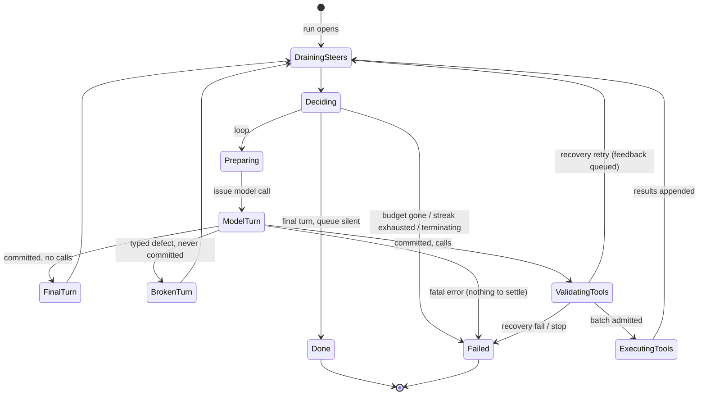

# ENGINE.md

The design record for the agent engine's turn state machine
(`rig-agent`'s `AgentRun`) — the backend counterpart to PROTOCOL.md's
frontend contract. Structure, not steps: this documents the machine's
states, each state's single responsibility, the machine/driver split,
and the behavior deltas of the redesign. The implementation refactor
follows this document; changes to the machine change this document.

## Why redesign

The current machine grew control flow inside data handlers instead of
as states, and the driver grew control decisions that belong to the
machine:

- **Three scattered steer drains** in `drive_agent` (defect path,
  post-turn, post-tool), each silently gated at runtime by
  `ready_for_steering()`. Steering is control flow — *when* it happens
  — but it lives as inline checks in data-handling arms. The silent
  no-op gate makes misuse invisible: draining at an illegal point
  returns nothing and only tests catch it (this happened in practice).
- **`AwaitingAdvance`'s `next_step` arm carries five conditional
  responsibilities**: output-tool detection, output-schema re-prompt,
  output finalization-as-text, skip-pairing, and the
  Done-vs-CallTools decision.
- **The exit decisions are scattered**: `Done` is decided inside
  `next_step`, `MaxTurnsError` fires from `PreparingRequest`, the
  defect streak and hook-stop terminations are driver locals.

## The design

One rule, no special cases: **the run loop is drain → decide → model →
path → drain.** Every model call is preceded by exactly one drain and
one decision; every turn outcome (of the three kinds) feeds exactly one
drain. Steering drains are independent of tools, so all paths converge
at the same drain state.

### The machine contract

**Inputs** — the driver feeds the machine, and the contract is total:

| input | meaning | destination |
|---|---|---|
| `Final { turn }` | committed turn, no tool calls | FinalTurn |
| `Tools { turn }` | committed turn with tool calls | ValidatingTools |
| `Broken { defect }` | typed malformed-tool-call defect; nothing committed | BrokenTurn |
| `fatal { error }` | transport/provider failure; nothing to settle | Failed (direct) |
| `terminate { reason }` | a hook stopped the run | flag, read at Deciding |

**Flags owned by the machine** (the "data collected earlier" that
Deciding reads):

- `defect_streak` — consecutive discarded turns; reset by any committed
  turn and by any drained steer (a present, steering user is their own
  circuit breaker); capped at a named constant (currently 1).
- `terminating` — set by hook stops; exits at the next decision.
- `steers_drained` — set by the drain; distinguishes "queue was silent"
  from "queue drained into history".
- budget — turns consumed by committed model calls only (a discarded
  turn returns its slot; a recovery retry consumes another).
- `last_outcome` — what kind of turn (if any) just ended.

serde/suspension remains a property of the machine (it stays
serializable), but nothing serializes a run today — there are no
compatibility constraints, only the discipline.

### The state machine

### State responsibilities

Each state has exactly one. Where a state was considered for splitting
during design review, the verdict is recorded.

- **Preparing** — split the settled input into prompt + preceding
  context for the model call. *Self-review: the max-turns budget gate
  currently hiding here moves to Deciding — Preparing keeps nothing
  conditional.*
- **ModelTurn** — the provider turn is in flight; the driver drives it
  (request, stream, spans). The machine waits for one input of the
  five above.
- **FinalTurn** — commit the tool-free turn to history; in Tool output
  mode, apply the finalization policy (accept schema-valid text,
  re-prompt with feedback while budget remains, finalize best-effort).
  *Self-review: the output-mode conditional stays here deliberately —
  it is one policy ("what makes this turn final"), not two
  responsibilities.*
- **BrokenTurn** — discard the defective turn (it never entered
  history, on any provider), bump `defect_streak`. Simple path.
- **ValidatingTools** — scan the turn's calls for admission: invalid
  tool names go through recovery (repair / skip / fail / retry with
  feedback), which may pause the state awaiting the hook's answer.
  *Single concern: admission. Absorbs `ResolvingToolCalls`.*
- **ExecutingTools** — hold the admitted batch; receive paired results
  (`tool_results` is the closing transition into the convergence).
  *Single concern: custody. Execution itself (concurrency, drop
  guards) is the driver's.*
- **DrainingSteers** — **the one and only drain point**: take the whole
  queue, append to history, set `steers_drained` (which resets
  `defect_streak`). Legality is structural — the machine offers the
  drain exactly here, so draining anywhere else is unrepresentable,
  not silently ignored.
- **Deciding** — read the flags, choose: loop (→ Preparing), Done, or
  Failed with its reason (budget / streak exhaustion / terminating).
  *Pure: no I/O, no stored state — realized as the drain's exit
  transition, but kept a named decision point so every loop-or-exit
  conditional has exactly one home. A conditional found anywhere else
  is a design bug.*
- **Done / Failed** — terminals. Done carries the `PromptResponse`;
  Failed carries the reason and the full history.

### The machine/driver split

| machine (control) | driver (data) |
|---|---|
| classification of the turn result | issuing requests, spans, telemetry |
| stage transitions | forwarding stream items to the consumer |
| steering points (when) | fetching from the `SteeringSource` (what), feeding `steer()` |
| budget, streak, terminating flags | tool dispatch: concurrency, drop guards |
| loop-or-exit decision | hook invocation, memory append at Done |

### What the redesign deletes

- `ready_for_steering()` as a public runtime gate (structure replaces
  the check).
- `steer()`'s commit-the-pending-final-turn special case (FinalTurn
  commits at classification).
- The driver's three inline drains and its streak counter.
- `AwaitingAdvance`'s five-way conditional arm.
- `discard_turn` as a public transition (BrokenTurn's entry action).

### Behavior deltas (documented, intended)

1. **One drain point** (was three): the opening window now drains
   before the first model call. No-loss and ordering guarantees
   unchanged.
2. **Exhaustion only fires on a silent queue** — a drained steer resets
   the streak (owner ruling).
3. **The final turn commits at classification**, not lazily on the
   first steer.
4. **`max_turns` fires at Deciding** (after the drain), same observable
   outcome, one exit site instead of two.
5. **Hook stops unify** as the `terminating` flag read at Deciding
   (and at classification for pre-turn stops).

## Future branch points

Permission prompts insert an `AwaitingPermission` state between
ValidatingTools and ExecutingTools: allow → execute; deny → synthetic
result → converge at the drain; "always" → allow and remember. The
linear tool path makes the insertion point explicit — branching is
added by inserting states, not by growing conditionals inside existing
ones.

## Migration map (old → new)

| current | new home |
|---|---|
| `PreparingRequest` | Preparing (split only; budget gate → Deciding) |
| `AwaitingModel` | ModelTurn |
| `ResolvingToolCalls` + `resolve_invalid_tool_call` | ValidatingTools |
| `AwaitingAdvance` (no-tool arm) | FinalTurn |
| `AwaitingAdvance` (tools arm) | ValidatingTools entry + ExecutingTools |
| `AwaitingAdvance` (output-tool arm) | FinalTurn's finalization policy |
| `ExecutingTools` + `tool_results` | ExecutingTools (+ closing transition) |
| `Done` / `Failed` | Done / Failed |
| driver defect path + `discard_turn` | BrokenTurn |
| driver `drain_steers` × 3 | DrainingSteers |
| driver streak counter | machine `defect_streak` flag |
| driver hook-stop exits | machine `terminating` flag |
| `retry_model_turn` (hook Retry) | FinalTurn transition (rejected turn re-queues; feedback mode records it) |
| `ready_for_steering` / `steer()` commit case | deleted (structural) |
