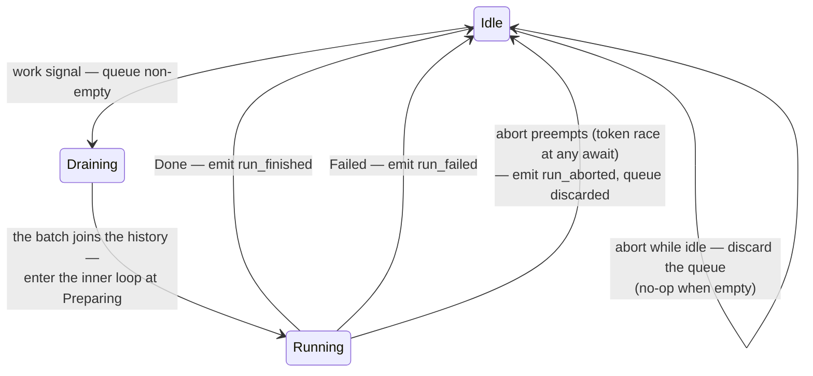
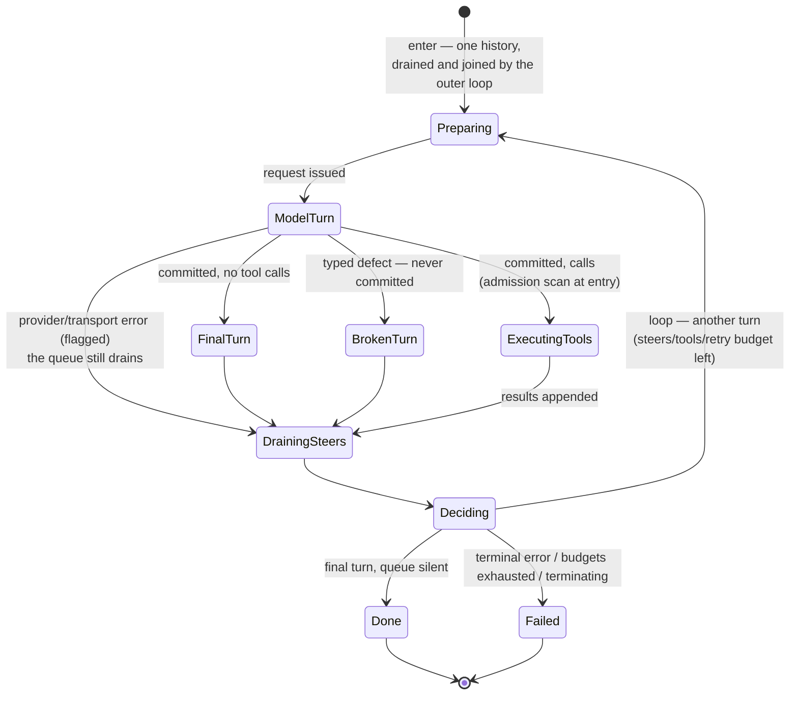

# ENGINE.md

The design record for the agent engine — the backend counterpart to
PROTOCOL.md's frontend contract. Two layers, kept strictly separate:

1. the **outer loop** — run lifecycle: when a run starts, what it is
   entered with, what it emits, how it is preempted — with the inner
   loop as a black box;
2. the **inner loop** — the turn state machine inside one run.

Structure, not steps: states, each state's single responsibility, the
machine/driver split, and the behavior deltas of the redesign. The
implementation follows this document; changes to the machine change
this document.

**Standing rule (owner):** flow-level changes consult this document
first and amend it before touching code. New flow behavior gets new
states (or new edges) — never conditionals grown inside existing
states, and never driver-side control flow outside the machine.
(PROTOCOL.md keeps the frontend/event view of the same
loop; the session actor implements the outer layer.)

## Layer 1 — the outer loop (the inner loop is a black box)

The **Draining** step is the outer loop's single responsibility between
idle and running: take the whole queue, join it into the history, and
yield each message's `user_message` event (the 1:1 invariant). It is
synchronous — no await between the take and entering the inner loop —
so nothing interleaves, and batching is exact.

**Entry contract** (what the outer layer hands the black box):

- the history **already joined** with the opening batch — the outer
  loop's Draining step did the join, so the inner loop receives one
  history and sends it as-is;
- at least one turn of budget (`max_turns ≥ 1` — entering a run that
  cannot run is unrepresentable).

**Exit contract** (what the black box guarantees):

- **at least one turn runs** — control never enters and leaves without
  issuing a model call;
- exactly one terminal: `Done(response)` or `Failed(reason)` — unless
  an internal error panics, which produces no terminal by design (the
  process dies; that is the loud failure);
- the run never observes abort as a state — abort preempts it from
  outside (the token races the in-flight awaits); the outer layer
  records `Aborted` and discards the queue.

**Outer-layer responsibilities:** queue custody (the always-queue
invariant — every message yields exactly one user event or steers the
run in flight; the only discard is abort), the Draining step
(opening-input construction), terminal-event emission, preemption.
Implemented today by the tabit-session actor (`pump`/`run_one` + the
mailbox and cancel token); documented here because the entry/exit
contracts above are what the inner machine is designed against.

**One queue, two drains:** the outer drain opens runs (Idle →
Draining → Running); the inner drain converges turn outcomes. Both
take the whole queue at their instant. A message arriving while idle
lands in the outer drain; during a run, in the inner one. No-loss and
ordering hold across both.

## Layer 2 — the inner loop (one run's turn machine)

Entry is **Preparing**: it takes the existing history and constructs
the request. Every later iteration is preceded by exactly one drain
and one decision. **Every** turn outcome — final, broken, tools, and
failure — converges at the same drain, because steering is
independent of everything the model does.

**The drain is unconditional.** Steering messages are information the
user sent *for the model* — extra context, or a correction when the
user noticed the model on (or about to be on) a wrong path. A
model-side failure does not invalidate them, so nothing except abort
(a user action) ever discards or strands them: every outcome drains
the queue into history first, and a run that then fails carries that
history forward — the messages are recorded, surfaced as events, and
seen by the next attempt. There are **no bypass edges**.

### Error taxonomy (what a model turn can fail with)

| class | examples | handling |
|---|---|---|
| model-side defect | tool-call arguments that cannot be parsed | BrokenTurn; bounded retry; steers reset the streak |
| model-side mistake | a tool name not in the registry | admission scan at ExecutingTools entry: an in-band synthetic result tells the model; never stops the run |
| retryable provider/transport | rate-limit, transient connection failures, timeouts | drained, then bounded retry through the normal loop |
| terminal provider | auth failure, permanent quota, context overflow | drained, then exit-Failed — history (with steers) carries forward |
| internal (ours) | request construction, our own invariants | **panic and hard stop** — a development bug; the process dies loud. Not a state machine path and not a terminal: there is nothing graceful to do with ourselves |

A drained steer resets every retry streak, for the same reason as the
defect streak: new user input changes the situation, and the budgets
bound unattended loops. Retry budgets are small named constants.

### The machine contract

**Inputs** — the driver feeds the machine, and the contract is total:

| input | meaning | destination |
|---|---|---|
| `Final { turn }` | committed turn, no tool calls | FinalTurn |
| `Tools { turn }` | committed turn with tool calls | ExecutingTools (admission at entry) |
| `Broken { defect }` | typed malformed-tool-call defect; nothing committed | BrokenTurn |
| `error { class, reason }` | a provider/transport failure, classified per the taxonomy | flagged → DrainingSteers |
| `terminate { reason }` | a hook stopped the run | flag, read at Deciding |

**Flags owned by the machine** (the "data collected earlier" that
Deciding reads):

- `pending_error` — the classified error from the last turn, if it
  failed; Deciding retries it (budget permitting) or exits with it.
- retry streaks — consecutive failed attempts per retryable class
  (defects, retryable provider errors); each capped at a small named
  constant; reset by any committed turn and by any drained steer (a
  present, steering user is their own circuit breaker).
- `terminating` — set by hook stops; exits at the next decision.
- `steers_drained` — set by the drain; distinguishes "queue was silent"
  from "queue drained into history".
- budget — turns consumed by committed model calls only (a discarded
  turn returns its slot; a recovery retry consumes another).
- `last_outcome` — what kind of turn (if any) just ended; Deciding's
  exits are unreachable before the first outcome exists (the
  at-least-one-turn invariant, structurally).

serde/suspension remains a property of the machine (it stays
serializable), but nothing serializes a run today — there are no
compatibility constraints, only the discipline.

### State responsibilities

Each state has exactly one. Where a state was considered for splitting
during design review, the verdict is recorded.

- **Preparing** — take the existing history and construct the request.
  **The request is the history — no prompt/context split** ("just send
  the history", the same ruling that shaped `stream_chat`); consumers
  that need "the message being answered" (hooks, cancel errors) derive
  it as the history's last message, a view, not a field. Emits the
  model-call step carrying the whole history. *Self-review: the
  max-turns budget gate currently hiding in `PreparingRequest`'s
  `next_step` moves to Deciding — Preparing keeps nothing conditional.*
- **ModelTurn** — the provider turn is in flight; the driver drives it
  (request, stream, spans). The machine waits for one input of the
  five above.
- **FinalTurn** — commit the tool-free turn to history; in Tool output
  mode, apply the finalization policy (accept schema-valid text,
  re-prompt with feedback while budget remains, finalize best-effort).
  *Self-review: the output-mode conditional stays here deliberately —
  it is one policy ("what makes this turn final"), not two
  responsibilities.*
- **BrokenTurn** — discard the defective turn (it never entered
  history, on any provider), bump the defect streak. Simple path.
- **ExecutingTools** — admit the batch, hold it, receive paired
  results. Admission is a pure scan at entry: a call whose name is not
  in the registry is a *model-side mistake* — it executes as an
  in-band synthetic result naming the problem, so the model is told
  and can fix it; the run never stops on the model's own error (there
  is nothing a user could do about it). *Single concern: custody.
  Execution itself (concurrency, drop guards) is the driver's.
  Validating is deliberately not a separate state — with no
  interactive recovery it never pauses, and states exist where the
  machine can await input. The permission stage below will be one, and
  will be added when it exists.*
- **DrainingSteers** — **the one and only drain point**: take the whole
  queue, append to history, set `steers_drained` (which resets every
  retry streak). Legality is structural — the machine offers the
  drain exactly here, so draining anywhere else is unrepresentable,
  not silently ignored.
- **Deciding** — read the flags, choose: loop (→ Preparing), Done, or
  Failed with its reason (budget / streak exhaustion / terminating).
  *Pure: no I/O, no stored state — realized as the drain's exit
  transition, but kept a named decision point so every loop-or-exit
  conditional has exactly one home. A conditional found anywhere else
  is a design bug.*
- **Done / Failed** — terminals. Done carries the `PromptResponse`;
  Failed carries the reason and the full history.

### The machine/driver split

| machine (control) | driver (data) |
|---|---|
| classification of the turn result | issuing requests, spans, telemetry |
| stage transitions | forwarding stream items to the consumer |
| steering points (when) | fetching from the `SteeringSource` (what), feeding `steer()` |
| budget, streak, terminating flags | tool dispatch: concurrency, drop guards |
| loop-or-exit decision | hook invocation, memory append at Done |

### What the redesign deletes

- `ready_for_steering()` as a public runtime gate (structure replaces
  the check).
- `steer()`'s commit-the-pending-final-turn special case (FinalTurn
  commits at classification).
- The driver's three inline drains and its streak counter.
- `AwaitingAdvance`'s five-way conditional arm.
- `discard_turn` as a public transition (BrokenTurn's entry action).
- **The `InvalidToolCall` hook and its pause machinery** — the
  choices (`Fail`/`Retry`/`Repair`/`Skip`/`Stop`), the
  `ResolvingToolCalls` pause state, and `max_invalid_tool_call_retries`.
  Unknown tool names are handled in-band at admission; if a
  validation-time extension point is ever needed (permissions), it
  will be designed fresh, not restored in this form.
- Every failure path that skips the drain — there are none.
- Graceful handling of internal errors — they panic (see the
  taxonomy).

### Behavior deltas (documented, intended)

1. **One drain point** (was three), at the convergence — and it is
   unconditional: failures drain too; only abort discards.
2. **Retryable provider errors** (rate-limit, transient transport)
   are retried through the normal loop, bounded, with steers riding
   along — not an immediate hard stop.
3. **Exhaustion only fires on a silent queue** — a drained steer
   resets the streaks (owner ruling).
4. **Unknown tool names never stop or pause the run** — an in-band
   synthetic result tells the model; no hook question, no
   `UnknownToolCall` failure.
5. **The final turn commits at classification**, not lazily on the
   first steer.
6. **`max_turns` fires at Deciding** (after the drain), same observable
   outcome, one exit site instead of two.
7. **Hook stops unify** as the `terminating` flag read at Deciding
   (and at classification for pre-turn stops).
8. **Internal errors panic** — the process dies loud instead of
   degrading gracefully through the machine.

## Future branch points

Permission prompts insert an `AwaitingPermission` stage in the tool
path before execution: allow → execute; deny → synthetic result →
converge at the drain; "always" → allow and remember. It will be the
tool path's first genuinely pausable stage — the insertion point is
explicit, and branching is added by inserting states when they exist,
not by growing conditionals inside existing ones.

## Migration map (old → new)

| current | new home |
|---|---|
| tabit-session `pump`/`run_one` + mailbox + token | Layer 1 (already implemented; documented here for the contracts) |
| `PreparingRequest` | Preparing (split only; budget gate → Deciding) |
| `CallModel { prompt, history }` step split | deleted — the step carries the whole history; "the message being answered" is a derived last-message view |
| `AwaitingModel` | ModelTurn |
| `ResolvingToolCalls` + `resolve_invalid_tool_call` + the `InvalidToolCall` hook | deleted — admission is a pure scan at ExecutingTools entry; unknown names get in-band synthetic results |
| `max_invalid_tool_call_retries` | deleted (no interactive recovery) |
| `AwaitingAdvance` (no-tool arm) | FinalTurn |
| `AwaitingAdvance` (tools arm) | ExecutingTools entry (admission scan) |
| `AwaitingAdvance` (output-tool arm) | FinalTurn's finalization policy |
| `ExecutingTools` + `tool_results` | ExecutingTools (+ closing transition) |
| `Done` / `Failed` | Done / Failed |
| driver defect path + `discard_turn` | BrokenTurn |
| driver hard-fail on provider errors | `error { class }` input → drain → bounded retry or exit |
| driver `drain_steers` × 3 | DrainingSteers |
| driver streak counter | machine `defect_streak` flag |
| driver hook-stop exits | machine `terminating` flag |
| `retry_model_turn` (hook Retry) | FinalTurn transition (rejected turn re-queues; feedback mode records it) |
| `ready_for_steering` / `steer()` commit case | deleted (structural) |
