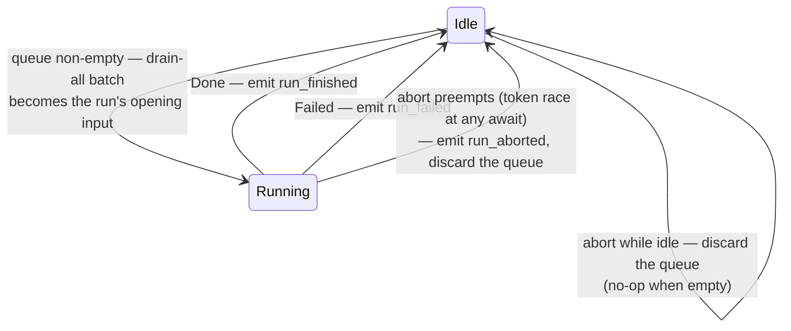
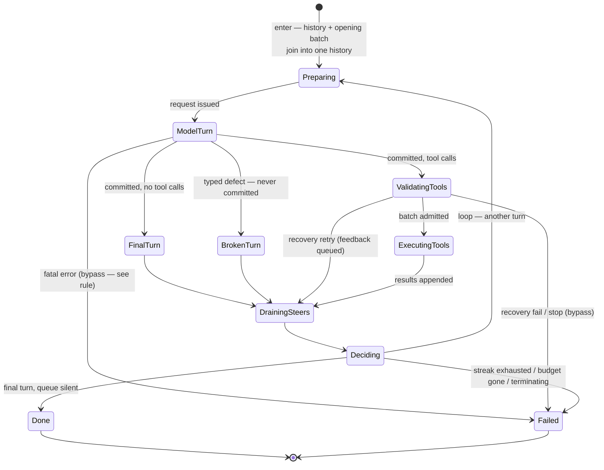

# ENGINE.md

The design record for the agent engine — the backend counterpart to
PROTOCOL.md's frontend contract. Two layers, kept strictly separate:

1. the **outer loop** — run lifecycle: when a run starts, what it is
   entered with, what it emits, how it is preempted — with the inner
   loop as a black box;
2. the **inner loop** — the turn state machine inside one run.

Structure, not steps: states, each state's single responsibility, the
machine/driver split, and the behavior deltas of the redesign. The
implementation follows this document; changes to the machine change
this document. (PROTOCOL.md keeps the frontend/event view of the same
loop; the session actor implements the outer layer.)

## Layer 1 — the outer loop (the inner loop is a black box)

**Entry contract** (what the outer layer hands the black box):

- the conversation history as it stands, plus the opening batch — the
  whole queue drained at entry, joined into one history the machine
  sends as-is;
- at least one turn of budget (`max_turns ≥ 1` — entering a run that
  cannot run is unrepresentable).

**Exit contract** (what the black box guarantees):

- **at least one turn runs** — control never enters and leaves without
  issuing a model call;
- exactly one terminal: `Done(response)` or `Failed(reason)`;
- the run never observes abort as a state — abort preempts it from
  outside (the token races the in-flight awaits); the outer layer
  records `Aborted` and discards the queue.

**Outer-layer responsibilities:** queue custody (the always-queue
invariant — every message yields exactly one user event or steers the
run in flight; the only discard is abort), opening-input construction
(drain-all at entry), terminal-event emission, preemption. Implemented
today by the tabit-session actor (`pump`/`run_one` + the mailbox and
cancel token); documented here because the entry/exit contracts above
are what the inner machine is designed against.

**One queue, two layers:** a message arriving while idle becomes the
next run's opening input (drained by the outer layer at entry); a
message arriving during a run lands at the inner loop's drain points.
No-loss and ordering hold across both.

## Layer 2 — the inner loop (one run's turn machine)

Entry is **Preparing**: it takes the existing history and constructs
the request. Every later iteration is preceded by exactly one drain
and one decision. The three turn outcomes — final, broken, tools —
converge at the same drain, because steering is independent of tools.

**The bypass rule:** exactly two edges skip the drain, and both are
families of *nothing settled* — no turn committed, nothing to
converge:

- **Fatal (provider/transport) errors** — everything the model turn
  can fail with except the typed defect: connection failures and
  resets mid-stream, timeouts, HTTP/provider errors (5xx, auth,
  rate-limit), malformed SSE the adapter rejects, and failures to
  issue the turn at all (request construction). The turn never
  completed; the provider error surfaces as the failure.
- **Recovery fail/stop** — the two terminal answers of invalid-tool-call
  resolution: the hook answers `Fail` (an unknown tool name with no
  recovery → `UnknownToolCall` error) or `Stop` (a policy stop with
  the hook's reason). The other answers — `Repair`, `Skip`,
  `Retry` — stay inside the loop; `Retry` re-queues with corrective
  feedback and converges at the drain like any turn outcome.

Bypassing is deliberate: a steer arriving while a run is dying must
survive queued for the next run, not be recorded into a dead one (the
owner's ruling against dead-lettering). Everything that settles — all
three outcomes, recovery retries, output re-prompt feedback — passes
through the drain before the decision. Hook `terminate` stops are not
bypasses either: they set the flag and exit at the next decision.

### The machine contract

**Inputs** — the driver feeds the machine, and the contract is total:

| input | meaning | destination |
|---|---|---|
| `Final { turn }` | committed turn, no tool calls | FinalTurn |
| `Tools { turn }` | committed turn with tool calls | ValidatingTools |
| `Broken { defect }` | typed malformed-tool-call defect; nothing committed | BrokenTurn |
| `fatal { error }` | transport/provider failure | Failed (bypass) |
| `terminate { reason }` | a hook stopped the run | flag, read at Deciding |

**Flags owned by the machine** (the "data collected earlier" that
Deciding reads):

- `defect_streak` — consecutive discarded turns; reset by any committed
  turn and by any drained steer (a present, steering user is their own
  circuit breaker); capped at a named constant (currently 1).
- `terminating` — set by hook stops; exits at the next decision.
- `steers_drained` — set by the drain; distinguishes "queue was silent"
  from "queue drained into history".
- budget — turns consumed by committed model calls only (a discarded
  turn returns its slot; a recovery retry consumes another).
- `last_outcome` — what kind of turn (if any) just ended; Deciding's
  exits are unreachable before the first outcome exists (the
  at-least-one-turn invariant, structurally).

serde/suspension remains a property of the machine (it stays
serializable), but nothing serializes a run today — there are no
compatibility constraints, only the discipline.

### State responsibilities

Each state has exactly one. Where a state was considered for splitting
during design review, the verdict is recorded.

- **Preparing** — take the existing history and construct the request.
  **The request is the history — no prompt/context split** ("just send
  the history", the same ruling that shaped `stream_chat`); consumers
  that need "the message being answered" (hooks, cancel errors) derive
  it as the history's last message, a view, not a field. Emits the
  model-call step carrying the whole history. *Self-review: the
  max-turns budget gate currently hiding in `PreparingRequest`'s
  `next_step` moves to Deciding — Preparing keeps nothing conditional.*
- **ModelTurn** — the provider turn is in flight; the driver drives it
  (request, stream, spans). The machine waits for one input of the
  five above.
- **FinalTurn** — commit the tool-free turn to history; in Tool output
  mode, apply the finalization policy (accept schema-valid text,
  re-prompt with feedback while budget remains, finalize best-effort).
  *Self-review: the output-mode conditional stays here deliberately —
  it is one policy ("what makes this turn final"), not two
  responsibilities.*
- **BrokenTurn** — discard the defective turn (it never entered
  history, on any provider), bump `defect_streak`. Simple path.
- **ValidatingTools** — scan the turn's calls for admission: invalid
  tool names go through recovery (repair / skip / fail / retry with
  feedback), which may pause the state awaiting the hook's answer.
  *Single concern: admission. Absorbs `ResolvingToolCalls`.*
- **ExecutingTools** — hold the admitted batch; receive paired results
  (`tool_results` is the closing transition into the convergence).
  *Single concern: custody. Execution itself (concurrency, drop
  guards) is the driver's.*
- **DrainingSteers** — **the one and only drain point**: take the whole
  queue, append to history, set `steers_drained` (which resets
  `defect_streak`). Legality is structural — the machine offers the
  drain exactly here, so draining anywhere else is unrepresentable,
  not silently ignored.
- **Deciding** — read the flags, choose: loop (→ Preparing), Done, or
  Failed with its reason (budget / streak exhaustion / terminating).
  *Pure: no I/O, no stored state — realized as the drain's exit
  transition, but kept a named decision point so every loop-or-exit
  conditional has exactly one home. A conditional found anywhere else
  is a design bug.*
- **Done / Failed** — terminals. Done carries the `PromptResponse`;
  Failed carries the reason and the full history.

### The machine/driver split

| machine (control) | driver (data) |
|---|---|
| classification of the turn result | issuing requests, spans, telemetry |
| stage transitions | forwarding stream items to the consumer |
| steering points (when) | fetching from the `SteeringSource` (what), feeding `steer()` |
| budget, streak, terminating flags | tool dispatch: concurrency, drop guards |
| loop-or-exit decision | hook invocation, memory append at Done |

### What the redesign deletes

- `ready_for_steering()` as a public runtime gate (structure replaces
  the check).
- `steer()`'s commit-the-pending-final-turn special case (FinalTurn
  commits at classification).
- The driver's three inline drains and its streak counter.
- `AwaitingAdvance`'s five-way conditional arm.
- `discard_turn` as a public transition (BrokenTurn's entry action).

### Behavior deltas (documented, intended)

1. **One drain point** (was three), at the convergence. The run's
   opening input is settled by the outer layer before entry — matching
   today's session semantics exactly; no opening-window delta.
2. **Exhaustion only fires on a silent queue** — a drained steer resets
   the streak (owner ruling).
3. **The final turn commits at classification**, not lazily on the
   first steer.
4. **`max_turns` fires at Deciding** (after the drain), same observable
   outcome, one exit site instead of two.
5. **Hook stops unify** as the `terminating` flag read at Deciding
   (and at classification for pre-turn stops).

## Future branch points

Permission prompts insert an `AwaitingPermission` state between
ValidatingTools and ExecutingTools: allow → execute; deny → synthetic
result → converge at the drain; "always" → allow and remember. The
linear tool path makes the insertion point explicit — branching is
added by inserting states, not by growing conditionals inside existing
ones.

## Migration map (old → new)

| current | new home |
|---|---|
| tabit-session `pump`/`run_one` + mailbox + token | Layer 1 (already implemented; documented here for the contracts) |
| `PreparingRequest` | Preparing (split only; budget gate → Deciding) |
| `CallModel { prompt, history }` step split | deleted — the step carries the whole history; "the message being answered" is a derived last-message view |
| `AwaitingModel` | ModelTurn |
| `ResolvingToolCalls` + `resolve_invalid_tool_call` | ValidatingTools |
| `AwaitingAdvance` (no-tool arm) | FinalTurn |
| `AwaitingAdvance` (tools arm) | ValidatingTools entry + ExecutingTools |
| `AwaitingAdvance` (output-tool arm) | FinalTurn's finalization policy |
| `ExecutingTools` + `tool_results` | ExecutingTools (+ closing transition) |
| `Done` / `Failed` | Done / Failed |
| driver defect path + `discard_turn` | BrokenTurn |
| driver `drain_steers` × 3 | DrainingSteers |
| driver streak counter | machine `defect_streak` flag |
| driver hook-stop exits | machine `terminating` flag |
| `retry_model_turn` (hook Retry) | FinalTurn transition (rejected turn re-queues; feedback mode records it) |
| `ready_for_steering` / `steer()` commit case | deleted (structural) |
