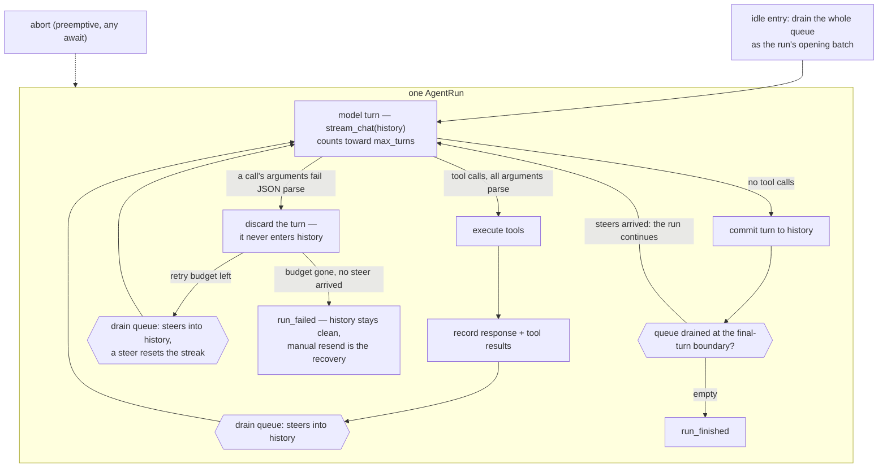

# PROTOCOL.md

The design record for the frontend protocol (ROADMAP item 7/8): what is
locked, and every open flag with its analysis and options, so nothing
gets re-derived. Flags are resolved by discussion in list order; a
resolved flag records its decision and stays as history.

## Locked design

- **Commands are fire-and-forget with total semantics** — `message`
  (steers the run in flight, or starts one), `abort` (aborts + discards
  the queue; no-op idle). No ids, no request/response, no rejection
  cases: every rejection case we could construct was a buggy client or
  better served by total semantics.
- **Every drain point takes the whole queue**: idle entry batches all
  pending messages into one run's opening input; the engine drains the
  rest as steers at turn boundaries. Invariant: every `message` yields
  exactly one `user_message` event; the only discard is abort.
- **Failures are events**: `RunFailed` + `RunOutcome::Failed`; the run
  path has no `Err` return (`prompt`/`prompt_with` are thin wrappers
  over `submit` + `pump`).
- **Events are stamped** `EventFrame { stream, event }`; v1 stamps
  `"main"` on everything (concurrent producers — subagents — mint
  siblings later; retrofitting stamps is a breaking sweep).
- **`stream_chat` takes a conversation**: the final message is the turn
  being sent (the engine's own rule for every turn); callers add
  messages to history before the call, retries resend verbatim. An
  empty conversation fails loudly at send.
- **Session files materialize at the first user message** (header +
  opening `model_change` + the message); a session that never runs
  leaves nothing on disk; `--list` reads a missing sessions directory as
  empty.
- **Handshake only at a serialized edge**: `initialize` →
  `initialize_ack` (session facts) or `initialize_rejected` + exit 1;
  unparseable lines / premature commands → `protocol_error`, connection
  stays. Tagged JSON lines, not JSON-RPC 2.0.
- **Termination contract**: `close_commands()` (or dropping every
  sender) ends the actor after the in-flight run; the event stream then
  closes. Close is not a barrier — commands already queued are honored.

## The outer loop

One `AgentRun`, from a user prompt to the final response. Steers are
drained at every turn boundary; a malformed tool call discards and
retries the turn (flag 21); abort is preemption and lives outside the
loop.

## Open flags (numbering is fixed at creation; resolved numbers are
skipped)

### 2. `run_one` failure epilogue — mechanical

Four sequential outcome blocks (aborted / stream-failure /
reload-failure / persist-failure) with a `!Failed` guard on the reload.
A `fail(..)` helper flattens it. No semantic change.

### 3. `run_one` length — cosmetic

~150 lines: recording + batch, engine fold, epilogue. The fold body can
extract beside `stream_item_event`.

### 6. Twin abort clears — document the proof

The actor's Abort handler and `run_one`'s aborted branch both clear the
mailbox; each covers a different interleaving (abort between runs vs
mid-run). Without a comment pair this reads like removable duplication.

### 8. Terminal events are not terminal — RULING WANTED

`RunFailed` can follow `RunFinished` (post-run persistence failure). A
frontend whose read loop stops at the first terminal silently misses
durability failures.

Options: accept and make "read to stream end" the law; or fold
durability into the terminal (`run_finished { durable: false }` +
a single follow-up), keeping "one terminal per run" true.

Recommendation: one terminal per run — the invariant is worth more
than the event's simplicity.

### 9. Empty conversation rides `PromptCancelled` — rename (broadened)

An empty history is not a cancellation; the variant name misleads. The
flag-21 pass widened the problem: `PromptCancelled` is now the de-facto
generic "run stopped early" carrier — a hook terminating the run, the
empty-conversation error, and malformed-tool-call exhaustion all ride
`run.cancel_error`, and the display string reads "PromptCancelled: …"
for none of them. (Abort does not ride it — preemption via the token.)

Open discussion, not settled: per-cause variants, or one honest
`RunStopped { reason, history }`-shaped arm with cancellation as just
one reason, or keep the umbrella and rename only.

### 10. `list()` platform divergence — documented, tested

Windows reads a blocked store path as empty (`NotFound`), Linux errors
(`ENOTDIR`). Inherent; the write side fails loudly everywhere.

### 11. Empty `pump()` reports `Completed` — document or forbid

Direct `pump()` calls on an empty mailbox return a vacuous `Completed`.
`prompt_with` cannot hit it. Document, or make it unrepresentable.

### 13. The protocol borrows engine types — RULING WANTED

`RunFinished { usage: rig_core::Usage }` and `NativeItem { Value }`
put engine shapes on the wire: engine refactors churn the protocol
silently, and `NativeItem` is provider knowledge leaking into
frontends. Options: protocol-owned slim types (our own `Usage`, typed
or explicitly-opaque native items), or accept rig-core as the shared
vocabulary crate (it is ours). Recommendation: own the types — the
protocol is the foundation; the engine is an implementation detail.

### 14. `RunFailed` is stringly — small

A display string, not a kind; frontends cannot branch
retryable-vs-fatal without string matching. Add a small kind enum
(`provider`, `budget`, `durability`, `internal`).

### 15. Unbounded event channel — ledger with a trigger

A stalled frontend grows memory mid-run. Accepted at v1; the TUI
milestone needs the real backpressure answer.

### 16. Ack-before-events ordering is causal, not structural — cheap fix

The bridge holds because the reader sends the ack before any command; a
reordered line breaks it silently. Structural fix: the forwarder starts
only after the handshake completes.

### 17. Mid-run test staging needs real sleeps — test infra

The `slow_tool` pattern (300ms per mid-run test). Engine-level
awaitable mock turns (a `Notify`-armed stream event) remove the latency
and the flake surface.

### 18. Callback type ergonomics — small

`&mut (dyn FnMut(SessionEvent) + Send)` is awkward at call sites; the
`Send` is forced by spawning. By-value `impl FnMut(SessionEvent) +
Send` or an owned box reads better.

### 19. Exit conventions differ by mode — unify

JSON mode returns `i32`; print mode signals via `Err` that `main`
converts. Two paths for one concept.

### 20. CI clippy skew — RESOLVED

Every code push needed a follow-up for a lint the local toolchain
lacked. Resolved by restoring the local stable toolchain to match CI
(rustc 1.97.1) and recording the rule in AGENTS.md: CI rides latest
stable; keep local current — a CI-only clippy failure is skew, update
first.

### 21. Malformed tool-call arguments — RESOLVED

One event, three policies: Anthropic errored the run (`Error`), OpenAI
Responses dropped the call with a warning (`Drop`), the compat gateway
dropped-on-flush / delivered `{}`-on-eviction. The shared vocabulary
(`UnparseableToolInput`) existed but forced no choice — an abstraction
gap, not a wire necessity.

Ruling (unified): **a malformed tool call is a model-side defect —
discard the turn, retry the request once.** The malformed turn never
enters history (on any provider, at any point — it is unreplayable on
the Anthropic wire, where `tool_use.input` must be a JSON object), so
retries resend the same conversation and exhaustion leaves the session
alive for a manual resend. This is a *content* retry in the engine's
turn loop, not the transport retry of the SSE note: the transport
succeeded and the response content failed validation; the mechanism is
a resample, and the two must not be conflated.

- **Trigger** — a tool call's raw arguments fail JSON *parse* (truncated
  mid-string, unbalanced braces, assembly-bound overflow) at turn
  assembly. Valid JSON with wrong parameters is explicitly NOT this
  path: tool dispatch already feeds those failures back to the model
  in-band, like any failing tool.
- **Turn granularity** — any unparseable call poisons the whole turn
  (a turn carrying it is unreplayable regardless of its siblings, and
  a partial batch cannot be paired with results).
- **Steers ride along** — steers drained at the discard boundary join
  the retry request (always-queue: steers land at the next model call,
  whatever caused it) **and reset the consecutive-discard streak** —
  the retry budget bounds runs the user has gone silent on; a present,
  steering user is their own circuit breaker (owner ruling on the
  exhaustion branch, superseding the shipped-without-approval deviation).
- **Counter** — consecutive discards, reset on any committed turn; cap
  1 (one retry, two attempts). Exhaustion → `run_failed` naming the
  cause and the levers (resend / raise `max_tokens`).
- **Budget** — a discarded turn does not count toward `max_turns`; it
  never entered history.
- **Accepted v1 residue** — the discarded turn's streamed deltas and
  usage were already forwarded (billing stays honest; text may visibly
  re-stream). Future option when a consumer needs it: a rewind-to
  event (erase below a message) or a stream cancel (drop the streamed
  block).
- **What survives where** — `Drop` only where a transport error already
  outranks the defect (pre-error flushes, no-terminal truncation);
  `EmptyObject` only for same-slot supersession (a different event).
- **Accepted edge** (owner-confirmed): a `finish_reason=tool_calls`
  frame followed by a transport death attributes to the defect and
  costs one retry. Fine either way — a persistent network error
  resurfaces on the retry; a transient one didn't matter.

### 22. Discarded-attempt usage never reaches the session log

The engine keeps a discarded turn's completion-call usage (the tokens
were spent; telemetry sees them), but the log records nothing —
`RecorderHook` fires only at `on_model_turn_finished`, which a
discarded turn never reaches — so `fold_stats` undercounts real spend
whenever a retry happened. Live providers bill the defective turn.

Options: (a) a `discarded` entry kind carrying usage — projection
skips it, stats count it, the log stays the cost source of truth;
(b) accept — session stats price committed turns only, engine
telemetry carries the full picture. Recommendation: (a), deferrable
until the stats view becomes a product surface (the TUI cost display).

## Resolved

- **1 — Resident loop** (supersedes 4, 5, 7, 12): one worker task owns
  the `Session` exclusively and forever — `loop { wait for work-signal /
  shutdown / receiver-dropped; pump to quiescence inline }`. Message and
  abort act directly on the shared leaves (mailbox + cancel token); the
  only intent that must preempt mid-run is abort, and it bypasses the
  queue by nature. Ownership never moves, so the handoff window, the
  `Option` dance, and the leftover branch do not exist. Evidence:
  codex's core is the same shape (one long-lived submission loop;
  steering = per-turn queue drained at model roundtrips; interrupt =
  CancellationToken raced at every await), while claurst — the
  ownership-handoff alternative — carries handoff-shaped scars (a
  documented cancel-token re-arm race, partial assistant text lost on
  mid-stream cancel, dead in-loop steering plumbing that rotted because
  no single owner executed it). Deliberately NOT adopted from codex:
  `Arc<Mutex<Session>>` + per-turn tasks (their interrupt routes
  through the loop; ours does not need to). Standing rule: mid-run
  capabilities enter as shared leaves (mailbox, token, future
  permission oneshots), never as session interior mutability.
- **4 — Termination**: explicit `close_commands()` token + dropping the
  frontend's whole handle (the worker watches the event receiver). The
  redundant channel-close arm is gone. In-flight runs finish either way.
- **5 — Close is not a barrier**: pushes are synchronous, so everything
  sent before `close_commands()` is already queued when the worker sees
  the token; the worker drains it before winding down. The contract is
  documented on `close_commands`.
- **7 — Untested leftover branch**: deleted structurally (see 1).
- **12 — Rapid-message batching**: deterministic under single-threaded
  schedulers (pushes are synchronous and the worker wakes only when the
  caller yields — tests and scripts get exact batching); on multi-thread
  runtimes a push racing the drain may steer instead. The guarantee is
  no-loss + order; exact batching where it is observable.
- **21 — Malformed tool-call arguments**: see the open-flags entry
  above for the full ruling — typed `MalformedToolCall` defect signal
  from all three providers, engine discards the turn and retries once,
  exhaustion fails the run with history clean. The exhaustion-branch
  deviation was ruled on by the owner: a steer drained at the discard
  boundary resets the streak, so exhaustion only fires on a silent
  queue; messages arriving after a failed run start the next run
  through the pump.
