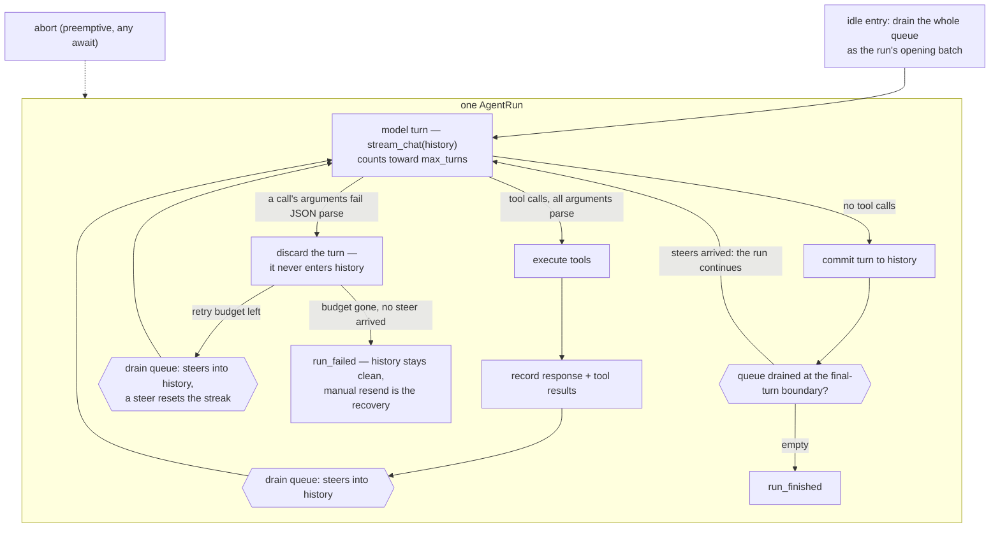

# PROTOCOL.md

The design record for the frontend protocol (ROADMAP item 7/8): what is
locked, and every open flag with its analysis and options, so nothing
gets re-derived. Flags are resolved by discussion in list order; a
resolved flag records its decision and stays as history.

## Locked design

v1 as shipped; the v2 and v3 sections below amend where noted.

- **Commands are fire-and-forget with total semantics** — `message`
  (steers the run in flight, or starts one), `abort` (aborts the run
  in flight and discards what was queued at abort time — flag 6;
  post-abort messages queue normally). No ids, no request/response,
  no rejection
  cases: every rejection case we could construct was a buggy client or
  better served by total semantics.
- **Every drain point takes the whole queue**: idle entry batches all
  pending messages into one run's opening input; the engine drains the
  rest as steers at turn boundaries. Invariant: every `message` yields
  exactly one `user_message` event; discards (abort at command time,
  checkout, the prompt barrier) each emit `messages_discarded` (v2).
- **Failures are events**: `RunFailed` + `RunOutcome::Failed`; the run
  path has no `Err` return (`prompt`/`prompt_with` are thin wrappers
  over `submit` + `pump`).
- **Events are stamped** `EventFrame { stream, event }`; v1 stamps
  `"main"` on everything (concurrent producers — subagents — mint
  siblings later; retrofitting stamps is a breaking sweep).
- **`stream_chat` takes a conversation**: the final message is the turn
  being sent (the engine's own rule for every turn); callers add
  messages to history before the call, retries resend verbatim. An
  empty conversation fails loudly at send.
- **Session files materialize at the first user message** (header +
  opening `model_change` + the message); a session that never runs
  leaves nothing on disk; `--list` reads a missing sessions directory as
  empty.
- **Handshake only at a serialized edge**: `initialize` →
  `initialize_ack` (session facts) or `initialize_rejected` + exit 1;
  unparseable lines / premature commands → `protocol_error`, connection
  stays. Tagged JSON lines, not JSON-RPC 2.0.
- **Termination contract (ruled 2026-08: the core dies with the
  frontend)**: two doors. `close_commands()` is the polite close for
  in-process consumers that stay to read the stream (print mode) —
  close is not a barrier, commands already queued are honored, the
  event stream ends after the in-flight run finishes. **Frontend
  death** — the event receiver dropped, or stdin EOF at a serialized
  edge — aborts the in-flight run and winds the actor down
  immediately, regardless of state: a parked interaction card or a
  half-finished turn never outlives the user. Interrupted results
  synthesize on the next open exactly like a crash; the log stays
  durable.
- **Interaction rides the ask pattern (ruled 2026-08, shipped with
  the permission milestone)**: `interaction_request { id, title,
  body, options, free_text }` (an event) answered by
  `interaction_response { id, option?, text? }` (a command — total
  semantics: at least one of option/text; an unknown id or a dead
  asker logs and drops, like abort-while-idle). One hub routes
  answers by id to the awaiting asker; askers are tool gates
  (permission — options [Allow, Always allow, Deny], the free-text
  denial reason is delivered to the model) and tool bodies (ask-the-
  user tools — the answer becomes the result; a tool may ask
  repeatedly). Every unanswered request's death coincides with a run
  terminal, so the frontend closes cards on terminals — no close
  event exists. Requests never persist or replay; the durable record
  is the tool result. ENGINE.md's tool-phase section owns the
  design; EXTENSIONS.md records the standard-model ruling.
- **Output-budget truncation is a warning, not a failure** (ruled
  2026-08, upstream-triage discussion; ENGINE.md behavior delta 9):
  when a committed turn's terminal reports a truncation-class finish
  reason (`Length`), the backend emits `turn_truncated` and the flow
  continues exactly as usual — steers drain into the next turn, the
  another-turn check is unchanged, the run may end normally. Partial
  tool calls stay on their own uniform path (in-band errors, never
  conditioned on the finish reason). The carrier: `CompletionCall`
  carries the turn's `finish_reason`, so the session warns per
  truncated turn.

## The outer loop

One `AgentRun`, from a user prompt to the final response. Steers are
drained at every turn boundary; a malformed tool call discards and
retries the turn (flag 21); abort is preemption and lives outside the
loop.

## Multi-session & subagent research (2026-08; pre-design, from local clones at 2026-08-23 heads)

pi, codex, opencode surveyed for the conversation-pointer family
(`new_session` / switch / checkout / subagent sessions). yaca excluded
(has none of these). Full findings in the session log; the load-bearing
record:

**pi** (no subagents; the tree reference): append-only immutable entry
tree; branch = in-memory leaf move, nothing written — and the leaf is
NOT persisted (reload = last line of file), a weakness our `rewound`
marker already fixes. The v4 harness journals pointer moves as "lanes"
(named `{lane, leafId}` cursors) and names subagents as a lane use case
("parallel work over shared history"). Context is always re-derived
from the path (compaction-aware), never stored. Switch = in-process
session swap that aborts in-flight work first; one live session per
process. UI update on branch switch = full clear + re-render (no diff
streaming). `fork(entryId)` copies root→target into a NEW session file
with `parentSession` linkage (same reserved field we carry).

**codex** (subagents = full threads): a subagent is a real thread — own
ThreadId, own JSONL rollout, own actor loop, spawned fire-and-forget
(the `spawn` tool returns an id immediately; results arrive out-of-band
as injected messages / inter-agent ops; the parent polls via `wait`).
Per-tree control object owns registry, depth/count limiters, and LRU
residency (idle children evicted, lazily reloaded). Linkage:
`parent_thread_id` in the rollout header plus a SQLite edge store. ALL
threads' events multiplex on one connection attributed by `thread_id`;
the TUI buffers non-active threads. There is NO server-side active
thread — only per-connection subscriptions; switching is
unsubscribe/resubscribe and in-flight runs keep running. TUI is an
app-server client (in-process embedded by default; daemon exists).

**opencode** (subagents = child sessions): `task` creates a real child
session row (`parentID`, indexed, queryable, recursively deleted);
messages persist in SQLite; same prompt pipeline as user prompts;
foreground (tool blocks) or experimental background (returns
immediately, result injected later). NO server-side active pointer at
all — every API is session-addressed; the TUI "switch" is a client
route change; per-session Runners run concurrently (per-session busy
guards). One SSE event stream, session-scoped, with a durable
per-session `seq` log and sync/replay routes for exact client catch-up.

**Convergences** (all three): subagent conversations are durable
first-class records, never ephemeral nested loops; all events ride one
channel attributed by conversation id; the backend owns all
conversation lifecycle; no restart to switch. **Divergence that
matters**: pi keeps one live session per process with an explicit
backend swap; codex/opencode drop the backend "active" pointer entirely
(session-addressed, client-held active, runs outlive attention).

**Ruled (2026-08, owner)**: **"active session" is not a backend
concept** — the codex/opencode model. A GUI instance is project-level;
several top-level sessions may be concurrently active (a feature in
one, a review in another). **Lazy loading**: the backend announces the
available sessions at startup and fully loads/replays only the
continued (boot) session; other sessions load on explicit frontend
request (header-only listing keeps startup cheap with many sessions).
**Checkout's frontend update is full re-render** (pi-proven; the
frontend requests a fresh replay pass) — built modular so a streamed
suffix can replace it later behind the same request shape if it ever
becomes a measured problem. These supersede the earlier one-active-
session worker design and the GUI-respawn new-session interim.

**Closing rulings (2026-08, owner)**: **always-explicit session
addressing** — every session-scoped command names its target id (a
deliberate wire break: no consumer keeps a silent default, so no
"forgot to update" slips through); **`sessions_available` stays
minimal** (a plain object — fields are cheap to add when needed);
**one connection per backend process** for now. Design in the v3
section below.

## v2 — ruled (2026-08; research recorded herein)

**Slice 1 shipped** (2026-08; vocabulary + ids, commits 7406a38..f5372ce):
engine-announced turn ids with an injected mint (delta 10, both edges —
`turn_started`/`turn_committed`), turn-scoped `turn_id` stamps and
`tool_result` `entry_id`, born-early message ids
(`message_queued`/`messages_discarded`/`user_message.entry_id`, the
mailbox's closed ledger), `tool_result` `content`+`status` with bash's
exit-code promotion, the generic `error { kind }` carrier with startup
degradations as first-frames-after-ack, the ack-gated stdio forwarder,
and protocol version 2 / session format 2. Slice 2 (replay) **shipped**
(2026-08): `initialize { replay: true }` streams the pass —
`replay_started { total }`, the active chain as finalized live events
(ids verbatim from the log, whole texts, tool names recovered from
their calls, bookkeeping excluded), `replay_done` — onto the worker's
own event channel, so it lands after the startup frames and ahead of
anything the next message starts (the worker answers replay requests
ahead of new work). The chain is resident on the session (parse once
per open, refreshed at each context re-derivation — the ruled
in-memory contract's first step); the projection lives in
`tabit-session/src/replay.rs`, the sibling of the model-facing
`projection.rs`. Live-vs-replay id continuity is pinned end-to-end by
`announced_turn_ids_are_the_log_entry_ids` and
`replay_re_emits_the_chain_with_live_ids_and_whole_texts`.

The egui GUI (ROADMAP item 7) is the second protocol consumer. What it
needs beyond `{message, abort}`, grounded in the references: **yaca**
replays resumed history as finalized live events — the same shapes live
would produce, one full-text delta per message, bracketed by
`session_resumed { total }` and per-entry `replay_progress`, replay
ids derived from log entry ids so a future rewind references something
stable; **codex** delivers a snapshot first plus pagination cursors
(`thread/resume` → populated turns), every item keyed by a UUIDv7 id,
rewind at turn granularity, and a generic multi-question ask-user
request with options + free text (`Denied { rejection }` carries the
user's reason back to the model). Tabit follows yaca's event replay —
yaca's log is the same parent-linked JSONL tree ours is, and
`Session::rewind_to_entry` already exists — and defers pagination
(coding-session transcripts are short; codex's cursors serve IDE-scale
histories).

- **One generic `error` event with a `kind`** (ruled). Error
  conditions that are not run terminals ride one carrier —
  `error { kind, message, … }` with optional kind-specific fields — so
  a minimal frontend implements a single handler (show the message)
  while a rich one switches on `kind`: `model` (a `model` command
  failed config validation), `checkout` (target missing or not a cut
  point), `persist_degraded { pending }`, `persist_recovered`. Unknown
  kinds fall back to generic display — the same forward-compat rule as
  unknown event types. `run_failed` stays its own event (it is a run
  terminal, not an error condition) and shares the kind vocabulary.
- **External errors ride the channel; stderr is not a frontend
  concern** (ruled). Everything that originates in daily use —
  config trouble, provider trouble, persistence degrade — reaches
  the frontend as an event, because telling the user what went
  wrong (and how to fix it) is the frontend's job and events are
  the only thing it can see. Direct consequences: the startup
  preference degradations (a stale `default_model`, a resumed
  session's model gone) become carrier events (kind `model`) as
  the first frames after the ack — resolution notes must thread
  into the session/actor rather than printing at construction —
  and library layers stop printing user-facing text; for
  transport-deep conditions (stall warnings) the mechanism is
  open (tracing + a binary-side bridge, or a transport callback).
  Internal errors are a separate track: panics should not exist in
  production, and when one does the user should be able to report
  it back in detail — that is process death with a stderr report,
  never the channel.
- **The atomic unit is the tool roundtrip** (ruled framing for cut
  points): an assistant turn and its complete tool-result batch commit
  and rewind as one unit — partial writes from crashes/aborts are
  repaired (synthesized results), never left half-open, and
  `checkout`/`base_id` can never land in-between. User messages and
  model changes are single-entry units.
- **`tool_result` carries the result** (ruled after the first GUI
  pass): the event gains `content` — exactly the text the model saw —
  plus `status`. `content` is the faithful copy: the tools cap output
  at the source (read's byte cap, bash's 128 KiB), failure text
  included, so the frontend never needs a second channel and never
  sees more than the model did. `status` is structure only, never
  prose: `success | failed { exit_code? }` — bash's exit code rides
  structure; the human-readable failure detail lives in `content`
  (a detail free-text field would fork the truth and drift).
  Riding along: the tool side promotes structure out of prose (bash
  currently formats its exit code into the text) through the
  internal `ToolResult`.
- **The tool-event taxonomy — the rest is named and deferred.** v1's
  `tool_call` fires args-complete, pre-execution; declare/delta
  (`tool_declare`/`tool_delta`) exist only when argument
  construction streams — niche, deferred until a consumer asks.
  `tool_start` — args accepted, execution beginning — becomes
  load-bearing at the permission milestone: it separates
  approval-pause from executing, so it lands with
  `interaction_request`, not before. `tool_progress` implies
  streaming tool output; deferred until a tool streams.
- **Replay on startup.** `initialize { protocol_version, replay: true }`
  → `initialize_ack` → `replay_started { total }` → the active chain's
  entries as finalized live events (`user_message` with its entry id;
  `turn_started`/`turn_committed` brackets with the turn's id around
  one full-text `text_delta` per assistant message; reasoning as one
  full-text `reasoning_delta` per block id; `tool_call`/`tool_result`
  pairs stamped with the turn id; `completion_call` per assistant turn;
  `model_changed` for `ModelChange` entries) → `replay_done`. Branch
  siblings are excluded
  by the chain walk; deltas are never persisted, so replay emits whole
  texts. Risk noted: yaca's implementation has never run in production —
  we adopt the approach, not the code. Our replay is a projection of
  our own chain walk (simpler than yaca's: no compaction to fold in
  yet), tested for ordering, branch exclusion, tool batches, and usage.
- **`message_queued { text, id }` — the submit-time ack for messages
  that wait, linked by id.** Emitted when a `message` command is
  accepted while a run is live (a steer sitting until the turn
  boundary). **Idle sends never queue** (ruled): the queue is known
  to drain immediately, so `user_message` — milliseconds later — is
  the acknowledgment and no queued event exists for it. This is not the rejected temp-id round trip: it is
  an event, not a response — no client-supplied id, no rejection
  cases, commands stay fire-and-forget. The `id` is the message's
  entry id, minted at accept time and carried into the log when the
  message drains — the same born-early principle as turn ids
  (`turn_started` at call start, entry at commit; `message_queued` at
  submit, entry at drain): identity is minted when the backend first
  acknowledges the thing. The GUI drops a pending display exactly when
  it sees a `user_message` or `messages_discarded` carrying that id —
  text or position matching cannot disambiguate duplicate texts, and
  replayed history emits `user_message` events with no queued
  counterparts. Accounting is a closed ledger by id: every
  `message_queued` id ends up in exactly one `user_message` or
  `messages_discarded`, never both.
- **`messages_discarded { messages: [{ id, text }] }` — clears
  salvage the queue.** Every mailbox clear emits the discarded pairs,
  ids included — abort's single clear at command time (the discard
  notice rides the actor's wind-down; flag 6), checkout's clear, and
  any future clear site joins them by rule. Nothing user-authored leaves
  the system silently. The frontend salvages them as drafts or
  pending input; the backend does not persist them — they were never
  part of the conversation, and undrained drafts die with the process
  pair, like unsaved editor text.
- **`checkout { entry_id }`** (renamed from `rewind`: the tree means the
  target can be any entry in the file, not just an ancestor —
  `git checkout <hash>` is the right metaphor; the next append branches
  from the target). Idle-only (the GUI composes abort-then-checkout;
  run state is derivable from events). Outcome events
  `checked_out { entry_id, base_id }`, or `error { kind: checkout }` on
  failure.
  **Checkout clears the mailbox** (ruling: steers are information
  bound to the context they were sent into; checkout changes context,
  so they do not carry over). `messages_discarded` hands them back as
  drafts — the user decides what, if anything, to resend onto the new
  branch.
  **Cross-branch checkouts resend the diff, not the chain.** The
  frontend holds only the active branch, so a target on another branch
  is content it has never seen: the backend — with the whole tree
  resident — computes where the old chain and the new chain diverge
  (`base_id`) and, after `checked_out`, streams the suffix the frontend
  never had as a replay pass (`replay_started { total }` → finalized
  events → `replay_done`), reusing the startup replay machinery. The
  GUI drops its own groups after `base_id` and applies the pass. When
  the target is an ancestor (the common rewind) the suffix is empty and
  nothing follows.
  *(Stage 2, 2026-08, superseded in part — see the v3 section: the
  command is session-addressed; the frontend update is full re-render
  (`base_id: null`), the suffix stream demoted to a reserved cheap
  upgrade; mid-run checkouts park for the pause point instead of
  erroring; and the mailbox clear is watermark-scoped — what was
  submitted before the checkout — not everything.)*
  **Entry ids are born early enough to be useful.**
  Uniform rule: every context entry's id appears on the wire on the
  event that announces it, and turn-scoped events carry `turn_id` so
  the frontend maps deltas to growing widgets. `user_message { text,
  entry_id }` (minted at drain); `tool_result` gains `entry_id` plus
  `turn_id`; turns are announced by `turn_started { id }` when the
  model call begins — the engine mints the id there (accepted
  refinement, 2026-08: the engine announces with an id drawn from an
  **injected id source** — the engine's default stays its short random
  ids, tabit injects its UUIDv7 mint, so the mint happens engine-side at
  announcement while the format stays the log owner's), every event of the
  turn is stamped with it (text/reasoning deltas, tool calls, usage),
  and the session records the committed entry **with that same id**,
  so live and replay ids are literally identical. (yaca's live-vs-log
  id split is an artifact of minting ids inside the append; we own the
  append — v1's `TextDelta` carried no correlation at all and worked
  only because one turn streams at a time.) A turn that never commits —
  aborted, provider-failed, discarded as a malformed-tool-call defect —
  leaves its announced id uncommitted; the frontend already discards
  provisional groups (`turn_retried`, abort), and ids are never reused.
- **Id generation is centralized in the backend.** The log owns
  identity: every entry id is a backend-minted UUIDv7; frontends never
  generate or supply ids, they learn them from events. Shape: the
  `message { text }` command is text-only; the id's first delivery
  vehicle is `message_queued` (minted at accept — see above), restated
  by `user_message { text, entry_id }` at drain. **Steers get ids like
  any other message** — one steer, one `UserMessage` entry (the log
  keeps 1:1 fidelity with what the model saw), one `user_message` event
  carrying its id. The exits from pending are draining and a discard
  (abort at command time, checkout, the prompt barrier) — every
  discard emits `messages_discarded`, so a pending id never vanishes
  silently. Neither frontend-supplied ids nor temp-id round trips are
  needed: the stdio channel's failure mode is process death (no dedup
  window to defend). Replay reuses log ids verbatim — stable across
  replays.
- **The frontend keeps the active branch only.** The GUI's transcript
  is the checked-out chain's events; the tree (abandoned branches,
  markers) is backend/log truth. Branch browsing, if ever wanted, is a
  future query over the backend's resident tree — not frontend state.
- **`model { provider, model, thinking_level? }`** — exactly
  `ModelSelection`, validated against config, applied from the next
  outer loop (mirrors the existing `ModelChange` entry kind). Outcome
  events `model_changed` / `error { kind: model }`. Commands stay
  total: nothing is rejected without an event.
- **Session listing stays one-shot.** Scan on startup and explicit
  reload (`tabit --list --json` — local or over ssh); no watch, no
  long-lived listing command.
- **`interaction_request` — shipped** (2026-08, with the permission
  milestone; the full ruling lives in Locked design above). The
  reserved-shape question that stayed open through v2 design — edge
  semantics — settled with it: run terminals close every pending
  request (the frontend rule), orphaned responses are logged no-ops,
  and nothing replays. The generic shape stands: any future
  ask-the-user surface reuses it rather than minting a new pop-up
  frame (EXTENSIONS.md).
- **`tabit-protocol` crate (flag 13 resolved by this)**: extract the
  vocabulary from tabit-session before GUI work — the GUI is Rust and
  shares the serde types (no codegen) without depending on persistence
  internals. The protocol owns `Usage` and native-item shapes.
- **Version numbering, no compat code.** The bump to 2 numbers the
  additive event changes (`user_message.entry_id`, new events) for the
  first release; before that release there is **no backward-compat
  code** — in-repo consumers move with every change.
- **Storage stays JSONL (re-checked for the GUI era).** A database buys
  indexed cross-session queries we don't have; JSONL keeps
  crash-safety-by-append, human/diff friendliness, and zero migrations.
  If cross-session features (search, all-sessions stats) ever become
  real, the answer is a derived, rebuildable index over the logs
  (sqlite as index, not source of truth).
- **The in-memory contract.** The backend parses the log once at open
  and keeps both the entry tree and the projected context resident:
  appends are O(1) in memory plus one JSONL line; checkout and stats
  read memory — nothing re-parses mid-session. (Today `rewind`, `stats`,
  and dangling-repair re-open the file per call — a wart the v2 session
  work removes.) The frontend accumulates events and receives the
  transcript exactly once per open (the replay pass); there are no
  per-turn re-sends.

- **Startup & recovery (ruled 2026-08, after the pi/codex/opencode
  survey): the chat UI is unconditional; config is not re-read per
  request.** Setup failures (config missing/malformed, zero models)
  reject the handshake with the setup guide as the reason; the GUI
  window stays alive showing the guide, and recovery is a manual
  reload — the GUI respawns the backend, which re-reads config, auth,
  and sessions (an in-process reload command is deferred until
  respawns actually annoy, which v2 replay should prevent). Lazy
  per-request resolution was ruled out: it complicates the
  architecture for no UX gain over a button. Two adjacent rulings:
  a resumed session's model that no longer resolves is a preference —
  warn and fall back (pi's behavior; explicit `--model` stays loud);
  and the launcher hands the GUI its exact executable (`--tabit
  <path>`), so backend-binary resolution is never a failure mode.
- **Death classification is pinned** (ruled 2026-08, after the first
  GUI review): every way the backend can end is classified by cause,
  and each cause has exactly one response. The GUI never infers
  cause from process shape, and **retry is capped at zero
  automatic** — nothing respawns on its own; the user's click is the
  only retry and the only rate limiter, and a persistent failure
  reproduces the same explained screen. The table:

  | cause | behavior | user sees |
  |---|---|---|
  | no config (first run) | `initialize_rejected` + setup guide | the guide; fix + reload |
  | `--continue`, empty store | **absorbed**: fresh session, ack `resumed: false` | the chat; "no sessions to resume — started fresh" |
  | malformed config / unbuildable model | rejected, plain reason (the guide is config-problems-only) | the specific reason; fix + reload |
  | session file unreadable | rejected, plain reason | the reason; start fresh (old file untouched) |
  | panic anywhere (incl. startup) | process exit 101 + stderr report | crash banner, report auto-shown, "send this back" |
  | killed / abnormal exit | no frame | "terminated unexpectedly" + restart |
  | spawn failure | GUI-side | OS reason verbatim + "if it persists, reinstall tabit" + retry |

  Rationale for the retry row: a spawn failure is the environment
  refusing, not the app misbehaving — the transient refusals
  (antivirus lock, memory pressure) resolve on a plain re-ask, and a
  deterministic one (broken install) keeps the reason on screen, so
  retrying buries nothing. The absorbed miss is not a retry — it is
  the same process answering the handshake. This pinned table
  deletes the GUI's auto-fresh-fallback (the five-clause respawn
  conditional): the class it papered over became backend policy.

Folded v2 work items — flags 8 (write-behind durability), 9 (the
stopped-kind taxonomy replacing the `PromptCancelled` umbrella), 14
(`run_failed` kinds), 16 (structural ack-before-events), 19 (the
FRONTEND.md exit table as the one law); each flag's entry carries the
settled shape.

## v3 — the multi-session host (ruled 2026-08)

Protocol version 3. The three closing rulings live in the research
section above; the design they locked:

- **Always-explicit session addressing.** Every session-scoped command
  names its target id: `message { session, text }`,
  `abort { session }`, `interaction_response { session, id, … }`. New
  commands (below): `new_session`, `open_session { id }`.
  Consequence: **the `"main"` stream alias is retired** — two names
  for one stream is exactly the ambiguity this ruling exists to kill.
  The stream stamp IS the session id; the boot session's id arrives in
  `initialize_ack`, so every consumer knows every stream name before
  its first event frame.
- **The backend is a session host, not a session.** One resident host
  loop routes commands to per-session workers — each worker is the
  v1/v2 resident loop unchanged (exclusive session ownership, mailbox
  + abort as shared leaves, pump to quiescence, replay answered at
  idle) with its own mailbox, pump, abort, and interaction hub,
  stamping its events with its session id. Runs in different sessions
  proceed concurrently (the feature-in-one, review-in-another ruling);
  one event channel, attribution by stamp. The termination doors are
  the host's: polite close cancels every worker (close is not a
  barrier — each drains first); frontend death aborts every in-flight
  run through the shared watcher and the stream ends.
- **Startup**: ack (boot facts) → startup notes → `sessions_available`
  → the requested boot replay pass. Lazy loading holds: only the boot
  session is loaded; the catalog is the store's header-only listing.
  The announcement is queued synchronously at spawn, ahead of the
  worker's first frame by construction. A listing failure is
  `error { kind: session }` (stamped boot) and no announcement.
- **`sessions_available { sessions: [{ id, created_at, entry_count }] }`**
  — newest first, minimal by ruling. Every stored session appears,
  including the boot's. A brand-new session (no file until its first
  message) does not.
- **`new_session {}` → `session_created { id, path }`** stamped with
  the new id, followed by that session's selection notes (if any). No
  replay — the session is empty. The host assembles it exactly like
  the boot session (config, tools, preamble; the process's
  `--model`/`--max-turns` apply). A build failure is
  `error { kind: session }` stamped with the boot stream (the host's
  primary voice; the command had no target id).
- **`open_session { id }`** — loads the session if needed (the resume
  path: full parse + repair) and streams a replay pass stamped with
  the id; idempotent (an already-open session re-replays on request).
  The pass itself is the acknowledgment. Failures (unknown id,
  unreadable file) are `error { kind: session }` stamped with the
  requested id.
- **The blocking matrix (ruled 2026-08: session lifecycle never waits
  on another session — different files, no pause point; only checkout
  needs one, and it is the same session's).** `new_session` and
  `open_session`'s load are host-level: no worker is consulted, no
  session's file is touched, a run in flight anywhere changes nothing
  (pinned by `new_session_is_never_blocked_by_a_running_session` —
  the new session is created, messaged, and finished while the boot
  run is mid-tool). This is structural, not incidental: the host
  loop's only awaits are the command channel and the shutdown token —
  routing (including both lifecycle builders) is synchronous, its
  locks are brief map operations never held across an await, and the
  builders touch no worker-owned session and write no session file.
  Any future "lifecycle needs to wait" dependency is a design bug,
  not a tuning question. The one wait in the design:
  `open_session`'s pass for a session whose **own** run is in flight
  waits for that run's terminal — the same-session pause point,
  checkout's class, never a cross-session block. The switch itself is
  immediate and the in-flight run's live streaming renders right
  away; only committed history waits. Why: each worker is its
  session's single event emitter, and that exclusivity is what orders
  a pass against live traffic — a wait-free history pass (a
  file-snapshot merged by ids/seq) arrives with the stage-4
  per-session seq primitive.
- **Routing errors are stamped with the stream they concern** — the
  targeted id for targeted commands, the boot stream for untargeted
  ones. A `message`/`abort`/`interaction_response` naming an unknown
  session yields `error { kind: session }` (commands stay total; the
  shape is unchanged). `ErrorKind::SESSION = "session"` joins the
  well-known kinds.
- **The frontend keeps one active view** (the shipped GUI shape): the
  transcript renders the active stream only. Switching is optimistic
  (clear the view immediately) + `open_session` (the pass rebuilds
  it) — the same full-re-render shape checkout will use, modular for a
  future suffix stream. Per-session liveness (running, an attention
  flag) rides the switcher rows; `error` events are always surfaced
  (stage 1: into the active transcript — an attribution imperfection
  accepted until multi-view).
- **Process-shared vs session-owned (reviewed 2026-08; owner ruling:
  the model registry is not session-owned — providers are user
  config, process-wide).** The criterion: an object is shared iff it
  holds a process-wide resource or a cross-session cache; immutable
  per-session copies are fine. Reviewed against every `Session`
  field:
  - **Shared per process**: `TabitConfig` and `AuthConfig` (Arc'd
    from the start) and the **model registry with its per-provider
    HTTP client caches** — one pool per provider per process. The
    tabit binary builds one registry and threads it through the boot
    assembly and the host's create/open wiring (the per-assembly mint
    is gone); `SessionBuilder::new`'s default factory still mints a
    per-builder registry as a single-session ergonomic default,
    documented as such.
  - **Session-owned, correct by design**: the selection and
    max-turns (per-session policy), the runtime leaves (mailbox,
    abort, interaction hub — the hub's always-allowed memory is
    session state by the EXTENSIONS.md ruling), the resident
    chain/context, the stats, the log writer.
  - **Session-owned copies, harmless by the criterion**: the preamble
    string and the tool-body instances (immutable, process-stable;
    per-session copies cost bytes and carry no cross-session cache).
    If either ever grows a process-wide resource, it moves to the
    shared list.
- Deferred with the machinery reserved: unload/LRU residency,
  per-session seq + suffix streaming (write-behind gains it first),
  `model` (stage 3), subagents as child sessions (stage 4;
  `parent_session` is the reserved linkage), background interaction
  surfacing.

### Stage 2 — `checkout` (ruled 2026-08; shipped)

- **`checkout { session, entry_id }`** — session-addressed like every
  session-scoped command (always-explicit). The target is any entry in
  the session's file, on or off the active chain — an off-chain target
  is a branch switch; the next append branches from the target
  (`git checkout <hash>`, not "rewind n").
- **Pause-point semantics — wait, never reject.** Idle: executes
  immediately. A run in flight: the checkout parks in the session's
  worker and executes at the run's terminal (the pause point), before
  the next batch drains — no implicit abort. Abort-then-checkout
  composes race-free for the same reason: abort acts at once, the
  parked checkout executes at the pause point however the run ended.
  `model` (stage 3) will join this class. This replaces the v2
  "idle-only, frontend holds the command" convention: the backend
  never errors on timing, so no frontend needs to time it.
- **Ordering under any interleaving.** Checkouts drain in wire order
  at the pause point, each validated against the file as it stands
  when it executes — a target is any file entry, so consecutive
  checkouts never collide (the later one moves the leaf again). A
  failing checkout (no such entry) is a no-op plus
  `error { kind: checkout }` stamped with the session; nothing is
  discarded for it. Messages submit to the mailbox under a monotonic
  arrival seq; each checkout carries the watermark minted at route
  time (host-loop order = wire order) and discards exactly what was
  submitted **before it** — the flag-6 before/after rule applied
  uniformly to clear sites. Messages submitted after the checkout are
  input for the new branch: they stay queued and the pump runs them
  against the rewound chain. So `m, C, m', C', m''` → C discards `m`,
  C' discards `m'`, and `m''` runs on the final rewound chain (C''s
  target — the last checkout wins). One guard makes this
  honest mid-run: the pump yields between batches when a checkout is
  parked (a post-checkout message can never start a batch on the old
  chain).
- **Frontend update: full re-render (ruled 2026-08).** The success
  sequence is `messages_discarded` (only if anything was discarded) →
  `checked_out { entry_id, base_id: null }` → the replay brackets
  (`replay_started { total }` → the rewound chain as finalized events
  → `replay_done`) — the same rebuild path as `open_session`'s switch
  pass. `base_id` stays on the wire as the reserved suffix-upgrade
  seam: `null` = drop everything and rebuild (today's only mode);
  a future `Some(id)` = keep through `id`, apply the (smaller) pass —
  the streamed-suffix optimization, adopted only if a measured
  problem, reusing the same bracket shape.
- `checkout` joins the routing errors rule: an unknown session yields
  `error { kind: session }` stamped with the named id. A mid-run
  `open_session` pass for the same session waits for the same pause
  point (worker single-emitter exclusivity orders pass vs live).

Staging: (1) this section — host + vocabulary + GUI command swap,
deleting the respawn interim; (2) `checkout` ✓; (3) `model`;
(4) subagents.

## Open flags (numbering is fixed at creation; resolved numbers are
skipped)

### 2. `run_one` failure epilogue — RESOLVED (extracted as `Session::conclude`)

The four-block epilogue (aborted / stream-failure / reload-failure /
persist-failure) now lives in its own named method, `conclude`, over an
`EventSink` (one emission path: live consumer + summary in one step, no
send-without-record). The write-behind restructure lands there alone;
`messages_discarded` joins the abort block. A `fail(..)` helper stopped
being worth it once `sink.emit` collapsed each block to two lines.

### 3. `run_one` length — RESOLVED (phase decomposition)

`run_one` is now orchestration over named phases: `stage_input` (the
v2 prompt-barrier seam), `open_run` (request assembly), `drive` (the
item fold — the translation seam v2 replay shares and where event ids
mint) with `note_tool_result`/`note_steer` for the recording arms, and
`conclude` (flag 2). The item→event translation lives in `drive` +
`stream_item_event`, extractable for replay without touching the loop.

### 6. Twin abort clears — RESOLVED (the second clear was wrong)

Ruled: abort discards only what was queued **at abort time**. Messages
arriving *after* the abort are post-abort input — they queue normally,
and the idle-entry drain starts the next run with them. "If a message
is sent after an abort, it shouldn't be killed by the abort."

So the twin collapses to **one clear, at the command link** (the
abort-command site); `run_one`'s run-end clear is deleted in v2 — it
existed to kill strays in the token-fire-to-wind-down window, which is
exactly the post-abort traffic that must now survive. Before/after is
defined by lock order (the only linearization available), and the
frontend sees precisely which messages died via `messages_discarded`.
Emission timing detail: the link clears on the caller's thread without
the event channel, so the discard notice rides the actor's wind-down
(next loop iteration) — still ordered before any subsequent
`user_message` events.

### 8. Terminal events are not terminal — RESOLVED (write-behind log)

`RunFailed` used to follow `RunFinished` on post-run persistence
failure. v2 folds the report into the terminal —
`run_finished { durable: false }`, one terminal per run — and moves
the real handling to a session-level write-behind policy (owner
design, 2026-08, validated against the references):

- **Memory first, disk second.** Commit = append the entry to an
  in-memory buffer (never fails short of OOM), then try to flush the
  buffer to disk. Failed-to-flush entries stay in the buffer and are
  retried on every subsequent commit, plus one final attempt at clean
  exit (force stop can't be helped — that loss is accepted and
  documented).
- **Events ride the generic error carrier** (v2's `error { kind }`):
  `error { kind: persist_degraded, pending, message }` on entering the
  failed state, `error { kind: persist_recovered }` when the buffer
  drains; `run_finished.durable` = buffer empty at the terminal.
  Frontends branch on the kind to nag about disk space, not
  string-match.
- **Implementation shape:** the buffer flushes FIFO (the file is
  always a clean prefix of commit order — kills the orphan corner by
  construction); the writer holds two cursors (parent-chain leaf,
  which advances at buffer time so entries chain in commit order, and
  the durable leaf, which lags); a failed write rolls back to the last
  good offset (`set_len` + seek) so a retried entry can never splice a
  torn line; the existing torn-tail repair stays as the reopen net.
  Buffer growth under sustained disk-full is unbounded and accepted
  (a session's entries are MBs at worst) — documented limit.

Precedent: **codex ships this exact shape** — rollout items buffer in
`pending_items`, leave only after a successful write, are retried with
file-reopen on the next barrier, and turn-item persistence failure is
logged-and-continued (`rollout/src/recorder.rs:1603-1676`,
`core/src/session/mod.rs:3671`). **pi** has zero handling (the sync
throw kills the run, raw `ENOSPC` in the TUI; the newer harness JSONL
store has hygiene but isn't the production path). **opencode** dies
the turn via SQLite defects, no retry. Databases fail hard (they
promise durability); editors buffer-and-retry (memory is
authoritative) — a session log is the editor class.

**Prompt barrier (ruled, with the owner's discard twist):** a turn
does not start until its opening user message is durable. At drain the
buffer flushes through the prompt entry first; if the flush fails, the
batch is not held — it is discarded (`messages_discarded` hands the
texts back as drafts, the existing salvage path) and an
`error { kind: persist_degraded }` explains why. No turn ever runs on
input that exists only in memory; force-stop buffer loss costs model
output, never user input.

Implementation shape addition: **the buffer is not the runtime
state.** The session keeps its resident tree and projected context
(the conversation truth); the writer owns a linear FIFO of unflushed
entries (the outbox). Separate structs, one-way flow (session commits
→ writer buffers → disk), events flow back (degraded/recovered).

### 9. Empty conversation rides `PromptCancelled` — resolved by the v2 pass

The wire side is decided: the `run_failed { kind: stopped }` taxonomy
covers hook-terminate, empty-conversation, and malformed-tool-call
exhaustion (FRONTEND.md §6). The engine-side rename (`PromptCancelled`
becomes an honest typed stop in rig-agent) is implementation riding
the v2 engine touch.

An empty history is not a cancellation; the variant name misleads. The
flag-21 pass widened the problem: `PromptCancelled` is now the de-facto
generic "run stopped early" carrier — a hook terminating the run, the
empty-conversation error, and malformed-tool-call exhaustion all ride
`run.cancel_error`, and the display string reads "PromptCancelled: …"
for none of them. (Abort does not ride it — preemption via the token.)

Open discussion, not settled: per-cause variants, or one honest
`RunStopped { reason, history }`-shaped arm with cancellation as just
one reason, or keep the umbrella and rename only.

### 10. `list()` platform divergence — RESOLVED (disambiguate with metadata)

Ruled: unify with a metadata check — path missing → empty list (a fresh
install is normal); path exists but is not a directory, or any other
metadata error → loud error on both platforms. One nuance: use the
`fs::metadata` result match, not the boolean `Path::exists()`/`is_file()`
helpers — those swallow the error kind (a permission failure would
masquerade as "no sessions"). Implementation rides the v2 store touch.

### 11. Empty `pump()` — RESOLVED (explained no-op, unexplained panic)

Analysis: there IS exactly one legitimate way to reach an empty first
drain — a mailbox clear landing between the worker's `is_empty()`
check and `pump`'s `drain_all`. The abort command-time clear (flag 6)
is unsynchronized with the worker by design, and checkout's clear (v2)
joins it; in both cases the discarded-notice journal records what
happened. Ruled:

- **Explained empty drain** (the journal is non-empty — a clear raced
  the wake): a visible no-op. `pump` returns `Option<RunSummary>`;
  `None` = legitimately nothing ran.
- **Unexplained empty drain** (nothing cleared — messages vanished
  without cause): panic, per the internal-error doctrine. A future
  code path that drains the mailbox without signaling through the
  journal is a bug we want loud, not a vacuous `Completed` slipping
  by.

### 13. The protocol borrows engine types — RESOLVED (owner approved the v2 item)

The `tabit-protocol` extraction with protocol-owned `Usage` and
native-item shapes was item 6 of the v2 menu ("Looks fine"); the
open flag text simply was never updated.

`RunFinished { usage: rig_core::Usage }` and `NativeItem { Value }`
put engine shapes on the wire: engine refactors churn the protocol
silently, and `NativeItem` is provider knowledge leaking into
frontends. Options: protocol-owned slim types (our own `Usage`, typed
or explicitly-opaque native items), or accept rig-core as the shared
vocabulary crate (it is ours). Recommendation: own the types — the
protocol is the foundation; the engine is an implementation detail.

### 14. `RunFailed` is stringly — RESOLVED (v2 kind taxonomy)

Kinds: provider / budget / stopped (FRONTEND.md §6). `durability`
moved out of run_failed entirely (flag 8 folded it into
`run_finished.durable`); `internal` never reaches the wire — internal
errors panic by doctrine.

A display string, not a kind; frontends cannot branch
retryable-vs-fatal without string matching. Add a small kind enum
(`provider`, `budget`, `durability`, `internal`).

### 15. Unbounded event channel — tripwire cap (ruled); consumer backpressure deferred

Ruled: an arbitrarily high cap on the event channel — not backpressure,
a sanity tripwire. A producer that keeps dumping events every tick is a
bug, and breaching the cap fails loud (internal error, panic per
doctrine) instead of growing memory forever. What a legitimately slow
consumer should experience remains deferred to the GUI milestone.

### 16. Ack-before-events ordering — decided (structural), implementation pending

The forwarder starts only after the handshake completes; rides the
v2 JSON-mode touch.

The bridge holds because the reader sends the ack before any command; a
reordered line breaks it silently. Structural fix: the forwarder starts
only after the handshake completes.

### 17. Mid-run test staging needs real sleeps — deferred (ruled)

Keep `slow_tool` for now. The real answer arrives with the interaction
milestone: a fake model calls an interactive tool, and the tester
controls pacing through the protocol itself — send a steer after the
`interaction_request` event arrives but before answering it. The
pause-for-user-input point is the deterministic mid-run staging
position; no Notify mocks, no sleeps.

### 18. Callback type ergonomics — RESOLVED (by-value)

`impl FnMut(SessionEvent) + Send` by value — every call site builds a
fresh closure anyway, and the `Send` stays (the pump future runs in
the spawned worker). Owner fallback, recorded: if borrowing ever turns
into a fight (rule 9), shift responsibility instead — the callee
returns data or instructions and the caller operates on entities it
already owns (the sans-IO direction the engine's AgentRun already
takes).

### 19. Exit conventions differ by mode — RESOLVED (FRONTEND.md is the law)

FRONTEND.md §3 specifies the exit-code table (0 clean incl. EOF-edge
cases; 1 handshake rejection and bad-flag exits; 101 internal error —
process death with the stderr report); print mode already exits 1 on
run failure. Aligning
the code paths to that one table rides the v2 touch.

JSON mode returns `i32`; print mode signals via `Err` that `main`
converts. Two paths for one concept.

### 20. CI clippy skew — RESOLVED

Every code push needed a follow-up for a lint the local toolchain
lacked. Resolved by restoring the local stable toolchain to match CI
(rustc 1.97.1) and recording the rule in AGENTS.md: CI rides latest
stable; keep local current — a CI-only clippy failure is skew, update
first.

### 21. Malformed tool-call arguments — RESOLVED

One event, three policies: Anthropic errored the run (`Error`), OpenAI
Responses dropped the call with a warning (`Drop`), the compat gateway
dropped-on-flush / delivered `{}`-on-eviction. The shared vocabulary
(`UnparseableToolInput`) existed but forced no choice — an abstraction
gap, not a wire necessity.

Ruling (unified): **a malformed tool call is a model-side defect —
discard the turn, retry the request once.** The malformed turn never
enters history (on any provider, at any point — it is unreplayable on
the Anthropic wire, where `tool_use.input` must be a JSON object), so
retries resend the same conversation and exhaustion leaves the session
alive for a manual resend. This is a *content* retry in the engine's
turn loop, not the transport retry of the SSE note: the transport
succeeded and the response content failed validation; the mechanism is
a resample, and the two must not be conflated.

- **Trigger** — a tool call's raw arguments fail JSON *parse* (truncated
  mid-string, unbalanced braces, assembly-bound overflow) at turn
  assembly. Valid JSON with wrong parameters is explicitly NOT this
  path: tool dispatch already feeds those failures back to the model
  in-band, like any failing tool.
- **Turn granularity** — any unparseable call poisons the whole turn
  (a turn carrying it is unreplayable regardless of its siblings, and
  a partial batch cannot be paired with results).
- **Steers ride along** — steers drained at the discard boundary join
  the retry request (always-queue: steers land at the next model call,
  whatever caused it) **and reset the consecutive-discard streak** —
  the retry budget bounds runs the user has gone silent on; a present,
  steering user is their own circuit breaker (owner ruling on the
  exhaustion branch, superseding the shipped-without-approval deviation).
- **Counter** — consecutive discards, reset on any committed turn; cap
  1 (one retry, two attempts). Exhaustion → `run_failed` naming the
  cause and the levers (resend / raise `max_tokens`).
- **Budget** — a discarded turn does not count toward `max_turns`; it
  never entered history.
- **Accepted v1 residue** — the discarded turn's streamed deltas and
  usage were already forwarded (billing stays honest; text may visibly
  re-stream). Future option when a consumer needs it: a rewind-to
  event (erase below a message) or a stream cancel (drop the streamed
  block).
- **What survives where** — `Drop` only where a transport error already
  outranks the defect (pre-error flushes, no-terminal truncation);
  `EmptyObject` only for same-slot supersession (a different event).
- **Accepted edge** (owner-confirmed): a `finish_reason=tool_calls`
  frame followed by a transport death attributes to the defect and
  costs one retry. Fine either way — a persistent network error
  resurfaces on the retry; a transient one didn't matter.

### 22. Discarded-attempt usage never reaches the session log — RESOLVED (discarded entry kind)

The engine keeps a discarded turn's completion-call usage (the tokens
were spent; telemetry sees them), but the log records nothing —
`RecorderHook` fires only at `on_model_turn_finished`, which a
discarded turn never reaches — so `fold_stats` undercounts real spend
whenever a retry happened. Live providers bill the defective turn.

Options: (a) a `discarded` entry kind carrying usage — projection
skips it, stats count it, the log stays the cost source of truth;
(b) accept — session stats price committed turns only, engine
telemetry carries the full picture. Ruled: (a). A `discarded` entry kind
carrying the attempt's usage — projection skips it (not model context),
stats count it, the log stays the cost source of truth. Implementation
rides the v2 session work.

## Resolved

- **1 — Resident loop** (supersedes 4, 5, 7, 12): one worker task owns
  the `Session` exclusively and forever — `loop { wait for work-signal /
  shutdown / receiver-dropped; pump to quiescence inline }`. Message and
  abort act directly on the shared leaves (mailbox + cancel token); the
  only intent that must preempt mid-run is abort, and it bypasses the
  queue by nature. Ownership never moves, so the handoff window, the
  `Option` dance, and the leftover branch do not exist. Evidence:
  codex's core is the same shape (one long-lived submission loop;
  steering = per-turn queue drained at model roundtrips; interrupt =
  CancellationToken raced at every await), while claurst — the
  ownership-handoff alternative — carries handoff-shaped scars (a
  documented cancel-token re-arm race, partial assistant text lost on
  mid-stream cancel, dead in-loop steering plumbing that rotted because
  no single owner executed it). Deliberately NOT adopted from codex:
  `Arc<Mutex<Session>>` + per-turn tasks (their interrupt routes
  through the loop; ours does not need to). Standing rule: mid-run
  capabilities enter as shared leaves (mailbox, token, future
  permission oneshots), never as session interior mutability.
- **4 — Termination**: explicit `close_commands()` token + dropping the
  frontend's whole handle (the worker watches the event receiver). The
  redundant channel-close arm is gone. In-flight runs finish either way.
- **5 — Close is not a barrier**: pushes are synchronous, so everything
  sent before `close_commands()` is already queued when the worker sees
  the token; the worker drains it before winding down. The contract is
  documented on `close_commands`.
- **7 — Untested leftover branch**: deleted structurally (see 1).
- **12 — Rapid-message batching**: deterministic under single-threaded
  schedulers (pushes are synchronous and the worker wakes only when the
  caller yields — tests and scripts get exact batching); on multi-thread
  runtimes a push racing the drain may steer instead. The guarantee is
  no-loss + order; exact batching where it is observable.
- **21 — Malformed tool-call arguments**: see the open-flags entry
  above for the full ruling — typed `MalformedToolCall` defect signal
  from all three providers, engine discards the turn and retries once,
  exhaustion fails the run with history clean. The exhaustion-branch
  deviation was ruled on by the owner: a steer drained at the discard
  boundary resets the streak, so exhaustion only fires on a silent
  queue; messages arriving after a failed run start the next run
  through the pump.
