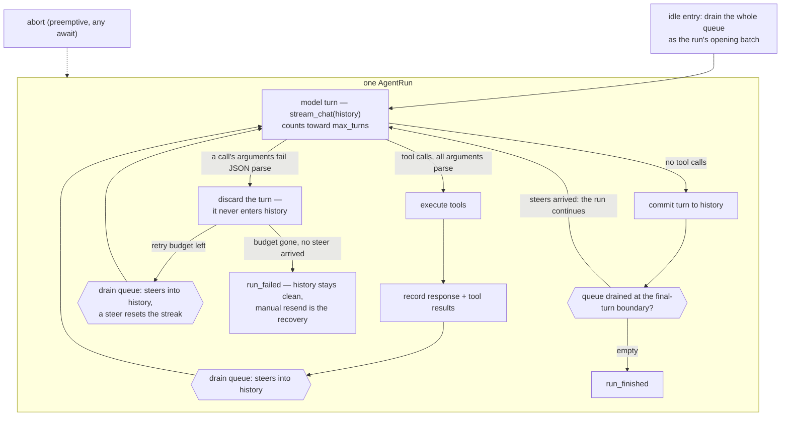

# PROTOCOL.md

The design record for the frontend protocol (ROADMAP item 7/8): what is
locked, and every open flag with its analysis and options, so nothing
gets re-derived. Flags are resolved by discussion in list order; a
resolved flag records its decision and stays as history.

## Locked design

- **Commands are fire-and-forget with total semantics** — `message`
  (steers the run in flight, or starts one), `abort` (aborts + discards
  the queue; no-op idle). No ids, no request/response, no rejection
  cases: every rejection case we could construct was a buggy client or
  better served by total semantics.
- **Every drain point takes the whole queue**: idle entry batches all
  pending messages into one run's opening input; the engine drains the
  rest as steers at turn boundaries. Invariant: every `message` yields
  exactly one `user_message` event; the only discard is abort.
- **Failures are events**: `RunFailed` + `RunOutcome::Failed`; the run
  path has no `Err` return (`prompt`/`prompt_with` are thin wrappers
  over `submit` + `pump`).
- **Events are stamped** `EventFrame { stream, event }`; v1 stamps
  `"main"` on everything (concurrent producers — subagents — mint
  siblings later; retrofitting stamps is a breaking sweep).
- **`stream_chat` takes a conversation**: the final message is the turn
  being sent (the engine's own rule for every turn); callers add
  messages to history before the call, retries resend verbatim. An
  empty conversation fails loudly at send.
- **Session files materialize at the first user message** (header +
  opening `model_change` + the message); a session that never runs
  leaves nothing on disk; `--list` reads a missing sessions directory as
  empty.
- **Handshake only at a serialized edge**: `initialize` →
  `initialize_ack` (session facts) or `initialize_rejected` + exit 1;
  unparseable lines / premature commands → `protocol_error`, connection
  stays. Tagged JSON lines, not JSON-RPC 2.0.
- **Termination contract**: `close_commands()` (or dropping every
  sender) ends the actor after the in-flight run; the event stream then
  closes. Close is not a barrier — commands already queued are honored.

## The outer loop

One `AgentRun`, from a user prompt to the final response. Steers are
drained at every turn boundary; a malformed tool call discards and
retries the turn (flag 21); abort is preemption and lives outside the
loop.

## v2 — proposed (ruling wanted; research recorded 2026-08)

The egui GUI (ROADMAP item 7) is the second protocol consumer. What it
needs beyond `{message, abort}`, grounded in the references: **yaca**
replays resumed history as finalized live events — the same shapes live
would produce, one full-text delta per message, bracketed by
`session_resumed { total }` and per-entry `replay_progress`, replay
ids derived from log entry ids so a future rewind references something
stable; **codex** delivers a snapshot first plus pagination cursors
(`thread/resume` → populated turns), every item keyed by a UUIDv7 id,
rewind at turn granularity, and a generic multi-question ask-user
request with options + free text (`Denied { rejection }` carries the
user's reason back to the model). Tabit follows yaca's event replay —
yaca's log is the same parent-linked JSONL tree ours is, and
`Session::rewind_to_entry` already exists — and defers pagination
(coding-session transcripts are short; codex's cursors serve IDE-scale
histories).

- **One generic `error` event with a `kind`** (ruled). Error
  conditions that are not run terminals ride one carrier —
  `error { kind, message, … }` with optional kind-specific fields — so
  a minimal frontend implements a single handler (show the message)
  while a rich one switches on `kind`: `model` (a `model` command
  failed config validation), `checkout` (target missing or not a cut
  point), `persist_degraded { pending }`, `persist_recovered`. Unknown
  kinds fall back to generic display — the same forward-compat rule as
  unknown event types. `run_failed` stays its own event (it is a run
  terminal, not an error condition) and shares the kind vocabulary.
- **The atomic unit is the tool roundtrip** (ruled framing for cut
  points): an assistant turn and its complete tool-result batch commit
  and rewind as one unit — partial writes from crashes/aborts are
  repaired (synthesized results), never left half-open, and
  `checkout`/`base_id` can never land in-between. User messages and
  model changes are single-entry units.
- **Replay on startup.** `initialize { protocol_version, replay: true }`
  → `initialize_ack` → `replay_started { total }` → the active chain's
  entries as finalized live events (`user_message` with its entry id;
  `turn_started`/`turn_committed` brackets with the turn's id around
  one full-text `text_delta` per assistant message; reasoning as one
  full-text `reasoning_delta` per block id; `tool_call`/`tool_result`
  pairs stamped with the turn id; `completion_call` per assistant turn;
  `model_changed` for `ModelChange` entries) → `replay_done`. Branch
  siblings are excluded
  by the chain walk; deltas are never persisted, so replay emits whole
  texts. Risk noted: yaca's implementation has never run in production —
  we adopt the approach, not the code. Our replay is a projection of
  our own chain walk (simpler than yaca's: no compaction to fold in
  yet), tested for ordering, branch exclusion, tool batches, and usage.
- **`message_queued { text, id }` — the submit-time ack, linked by
  id.** Emitted the moment the actor accepts a `message` command,
  before any drain. This is not the rejected temp-id round trip: it is
  an event, not a response — no client-supplied id, no rejection
  cases, commands stay fire-and-forget. The `id` is the message's
  entry id, minted at accept time and carried into the log when the
  message drains — the same born-early principle as turn ids
  (`turn_started` at call start, entry at commit; `message_queued` at
  submit, entry at drain): identity is minted when the backend first
  acknowledges the thing. The GUI drops a pending display exactly when
  it sees a `user_message` or `messages_discarded` carrying that id —
  text or position matching cannot disambiguate duplicate texts, and
  replayed history emits `user_message` events with no queued
  counterparts. Accounting is a closed ledger by id: every
  `message_queued` id ends up in exactly one `user_message` or
  `messages_discarded`, never both.
- **`messages_discarded { messages: [{ id, text }] }` — clears
  salvage the queue.** Every mailbox clear emits the discarded pairs,
  ids included — both abort interleavings (the actor's handler and the
  aborted-run branch; flag 6's twin clears), checkout's clear, and any
  future clear site joins them by rule. Nothing user-authored leaves
  the system silently. The frontend salvages them as drafts or
  pending input; the backend does not persist them — they were never
  part of the conversation, and undrained drafts die with the process
  pair, like unsaved editor text.
- **`checkout { entry_id }`** (renamed from `rewind`: the tree means the
  target can be any entry in the file, not just an ancestor —
  `git checkout <hash>` is the right metaphor; the next append branches
  from the target). Idle-only (the GUI composes abort-then-checkout;
  run state is derivable from events). Outcome events
  `checked_out { entry_id, base_id }` / `checkout_failed { message }`.
  **Checkout clears the mailbox** (ruling: steers are information
  bound to the context they were sent into; checkout changes context,
  so they do not carry over). `messages_discarded` hands them back as
  drafts — the user decides what, if anything, to resend onto the new
  branch.
  **Cross-branch checkouts resend the diff, not the chain.** The
  frontend holds only the active branch, so a target on another branch
  is content it has never seen: the backend — with the whole tree
  resident — computes where the old chain and the new chain diverge
  (`base_id`) and, after `checked_out`, streams the suffix the frontend
  never had as a replay pass (`replay_started { total }` → finalized
  events → `replay_done`), reusing the startup replay machinery. The
  GUI drops its own groups after `base_id` and applies the pass. When
  the target is an ancestor (the common rewind) the suffix is empty and
  nothing follows. **Entry ids are born early enough to be useful.**
  Uniform rule: every context entry's id appears on the wire on the
  event that announces it, and turn-scoped events carry `turn_id` so
  the frontend maps deltas to growing widgets. `user_message { text,
  entry_id }` (minted at drain); `tool_result` gains `entry_id` plus
  `turn_id`; turns are announced by `turn_started { id }` when the
  model call begins — the engine mints the id there, every event of the
  turn is stamped with it (text/reasoning deltas, tool calls, usage),
  and the session records the committed entry **with that same id**,
  so live and replay ids are literally identical. (yaca's live-vs-log
  id split is an artifact of minting ids inside the append; we own the
  append — v1's `TextDelta` carried no correlation at all and worked
  only because one turn streams at a time.) A turn that never commits —
  aborted, provider-failed, discarded as a malformed-tool-call defect —
  leaves its announced id uncommitted; the frontend already discards
  provisional groups (`turn_retried`, abort), and ids are never reused.
- **Id generation is centralized in the backend.** The log owns
  identity: every entry id is a backend-minted UUIDv7 at append;
  frontends never generate or supply ids, they learn them from events.
  Shape: the `message { text }` command is text-only; the
  `user_message { text, entry_id }` event is the id's delivery vehicle.
  **Steers get ids like any other message** — one steer, one
  `UserMessage` entry (the log keeps 1:1 fidelity with what the model
  saw), one `user_message` event carrying its id. The id exists from
  the moment the message is *drained into a run* (batch open or turn
  boundary), not from submission: a message sitting in the mailbox has
  no id and never needs one — abort is its only exit. Neither
  frontend-supplied ids nor temp-id round trips are needed: the stdio
  channel's failure mode is process death (no dedup window to defend).
  Replay reuses log ids verbatim — stable across replays.
- **The frontend keeps the active branch only.** The GUI's transcript
  is the checked-out chain's events; the tree (abandoned branches,
  markers) is backend/log truth. Branch browsing, if ever wanted, is a
  future query over the backend's resident tree — not frontend state.
- **`model { provider, model, thinking_level? }`** — exactly
  `ModelSelection`, validated against config, applied from the next
  outer loop (mirrors the existing `ModelChange` entry kind). Outcome
  events `model_changed` / `model_error { message }`. Commands stay
  total: nothing is rejected without an event.
- **Session listing stays one-shot.** Scan on startup and explicit
  reload (`tabit --list --json` — local or over ssh); no watch, no
  long-lived listing command.
- **`interaction_request` (generic, reserved).** One pop-up shape for
  permission and future ask-the-user tools:
  `interaction_request { id, title, body, options: [{ label,
  description? }], free_text: bool }` answered by
  `interaction_response { id, option, text? }`. Permission is options
  [Allow, Always allow, Deny] with `free_text` on (the rejection
  reason goes back to the model, per codex's `Denied { rejection }`);
  the shape is deliberately generic — any future ask-the-user tool
  would reuse it; none is planned. v2 reserves the wire shape;
  implementation lands with the permission milestone (ENGINE.md's
  planned pausable tool-path stage).
- **`tabit-protocol` crate (flag 13 resolved by this)**: extract the
  vocabulary from tabit-session before GUI work — the GUI is Rust and
  shares the serde types (no codegen) without depending on persistence
  internals. The protocol owns `Usage` and native-item shapes.
- **Version numbering, no compat code.** The bump to 2 numbers the
  additive event changes (`user_message.entry_id`, new events) for the
  first release; before that release there is **no backward-compat
  code** — in-repo consumers move with every change.
- **Storage stays JSONL (re-checked for the GUI era).** A database buys
  indexed cross-session queries we don't have; JSONL keeps
  crash-safety-by-append, human/diff friendliness, and zero migrations.
  If cross-session features (search, all-sessions stats) ever become
  real, the answer is a derived, rebuildable index over the logs
  (sqlite as index, not source of truth).
- **The in-memory contract.** The backend parses the log once at open
  and keeps both the entry tree and the projected context resident:
  appends are O(1) in memory plus one JSONL line; checkout and stats
  read memory — nothing re-parses mid-session. (Today `rewind`, `stats`,
  and dangling-repair re-open the file per call — a wart the v2 session
  work removes.) The frontend accumulates events and receives the
  transcript exactly once per open (the replay pass); there are no
  per-turn re-sends.

Folded v2 work items: flags 8 (one terminal per run — fold durability
into `run_finished { durable: bool }`), 9 (`PromptCancelled` →
`RunStopped { reason }`), 14 (`RunFailed` kind enum), 16 (structural
ack-before-events), 19 (unified exit conventions).

## Open flags (numbering is fixed at creation; resolved numbers are
skipped)

### 2. `run_one` failure epilogue — mechanical

Four sequential outcome blocks (aborted / stream-failure /
reload-failure / persist-failure) with a `!Failed` guard on the reload.
A `fail(..)` helper flattens it. No semantic change.

### 3. `run_one` length — cosmetic

~150 lines: recording + batch, engine fold, epilogue. The fold body can
extract beside `stream_item_event`.

### 6. Twin abort clears — document the proof

The actor's Abort handler and `run_one`'s aborted branch both clear the
mailbox; each covers a different interleaving (abort between runs vs
mid-run). Without a comment pair this reads like removable duplication.

### 8. Terminal events are not terminal — RESOLVED (write-behind log)

`RunFailed` used to follow `RunFinished` on post-run persistence
failure. v2 folds the report into the terminal —
`run_finished { durable: false }`, one terminal per run — and moves
the real handling to a session-level write-behind policy (owner
design, 2026-08, validated against the references):

- **Memory first, disk second.** Commit = append the entry to an
  in-memory buffer (never fails short of OOM), then try to flush the
  buffer to disk. Failed-to-flush entries stay in the buffer and are
  retried on every subsequent commit, plus one final attempt at clean
  exit (force stop can't be helped — that loss is accepted and
  documented).
- **Events, typed.** `persist_degraded { pending, message }` on
  entering the failed state, `persist_recovered` when the buffer
  drains; `run_finished.durable` = buffer empty at the terminal.
  Typed per flag 14's philosophy: frontends branch to nag about disk
  space, not string-match.
- **Implementation shape:** the buffer flushes FIFO (the file is
  always a clean prefix of commit order — kills the orphan corner by
  construction); the writer holds two cursors (parent-chain leaf,
  which advances at buffer time so entries chain in commit order, and
  the durable leaf, which lags); a failed write rolls back to the last
  good offset (`set_len` + seek) so a retried entry can never splice a
  torn line; the existing torn-tail repair stays as the reopen net.
  Buffer growth under sustained disk-full is unbounded and accepted
  (a session's entries are MBs at worst) — documented limit.

Precedent: **codex ships this exact shape** — rollout items buffer in
`pending_items`, leave only after a successful write, are retried with
file-reopen on the next barrier, and turn-item persistence failure is
logged-and-continued (`rollout/src/recorder.rs:1603-1676`,
`core/src/session/mod.rs:3671`). **pi** has zero handling (the sync
throw kills the run, raw `ENOSPC` in the TUI; the newer harness JSONL
store has hygiene but isn't the production path). **opencode** dies
the turn via SQLite defects, no retry. Databases fail hard (they
promise durability); editors buffer-and-retry (memory is
authoritative) — a session log is the editor class.

**Prompt barrier (ruled, with the owner's discard twist):** a turn
does not start until its opening user message is durable. At drain the
buffer flushes through the prompt entry first; if the flush fails, the
batch is not held — it is discarded (`messages_discarded` hands the
texts back as drafts, the existing salvage path) and an
`error { kind: persist_degraded }` explains why. No turn ever runs on
input that exists only in memory; force-stop buffer loss costs model
output, never user input.

Implementation shape addition: **the buffer is not the runtime
state.** The session keeps its resident tree and projected context
(the conversation truth); the writer owns a linear FIFO of unflushed
entries (the outbox). Separate structs, one-way flow (session commits
→ writer buffers → disk), events flow back (degraded/recovered).

### 9. Empty conversation rides `PromptCancelled` — rename (broadened)

An empty history is not a cancellation; the variant name misleads. The
flag-21 pass widened the problem: `PromptCancelled` is now the de-facto
generic "run stopped early" carrier — a hook terminating the run, the
empty-conversation error, and malformed-tool-call exhaustion all ride
`run.cancel_error`, and the display string reads "PromptCancelled: …"
for none of them. (Abort does not ride it — preemption via the token.)

Open discussion, not settled: per-cause variants, or one honest
`RunStopped { reason, history }`-shaped arm with cancellation as just
one reason, or keep the umbrella and rename only.

### 10. `list()` platform divergence — documented, tested

Windows reads a blocked store path as empty (`NotFound`), Linux errors
(`ENOTDIR`). Inherent; the write side fails loudly everywhere.

### 11. Empty `pump()` reports `Completed` — document or forbid

Direct `pump()` calls on an empty mailbox return a vacuous `Completed`.
`prompt_with` cannot hit it. Document, or make it unrepresentable.

### 13. The protocol borrows engine types — RULING WANTED

`RunFinished { usage: rig_core::Usage }` and `NativeItem { Value }`
put engine shapes on the wire: engine refactors churn the protocol
silently, and `NativeItem` is provider knowledge leaking into
frontends. Options: protocol-owned slim types (our own `Usage`, typed
or explicitly-opaque native items), or accept rig-core as the shared
vocabulary crate (it is ours). Recommendation: own the types — the
protocol is the foundation; the engine is an implementation detail.

### 14. `RunFailed` is stringly — small

A display string, not a kind; frontends cannot branch
retryable-vs-fatal without string matching. Add a small kind enum
(`provider`, `budget`, `durability`, `internal`).

### 15. Unbounded event channel — ledger with a trigger

A stalled frontend grows memory mid-run. Accepted at v1; the GUI
milestone needs the real backpressure answer.

### 16. Ack-before-events ordering is causal, not structural — cheap fix

The bridge holds because the reader sends the ack before any command; a
reordered line breaks it silently. Structural fix: the forwarder starts
only after the handshake completes.

### 17. Mid-run test staging needs real sleeps — test infra

The `slow_tool` pattern (300ms per mid-run test). Engine-level
awaitable mock turns (a `Notify`-armed stream event) remove the latency
and the flake surface.

### 18. Callback type ergonomics — small

`&mut (dyn FnMut(SessionEvent) + Send)` is awkward at call sites; the
`Send` is forced by spawning. By-value `impl FnMut(SessionEvent) +
Send` or an owned box reads better.

### 19. Exit conventions differ by mode — unify

JSON mode returns `i32`; print mode signals via `Err` that `main`
converts. Two paths for one concept.

### 20. CI clippy skew — RESOLVED

Every code push needed a follow-up for a lint the local toolchain
lacked. Resolved by restoring the local stable toolchain to match CI
(rustc 1.97.1) and recording the rule in AGENTS.md: CI rides latest
stable; keep local current — a CI-only clippy failure is skew, update
first.

### 21. Malformed tool-call arguments — RESOLVED

One event, three policies: Anthropic errored the run (`Error`), OpenAI
Responses dropped the call with a warning (`Drop`), the compat gateway
dropped-on-flush / delivered `{}`-on-eviction. The shared vocabulary
(`UnparseableToolInput`) existed but forced no choice — an abstraction
gap, not a wire necessity.

Ruling (unified): **a malformed tool call is a model-side defect —
discard the turn, retry the request once.** The malformed turn never
enters history (on any provider, at any point — it is unreplayable on
the Anthropic wire, where `tool_use.input` must be a JSON object), so
retries resend the same conversation and exhaustion leaves the session
alive for a manual resend. This is a *content* retry in the engine's
turn loop, not the transport retry of the SSE note: the transport
succeeded and the response content failed validation; the mechanism is
a resample, and the two must not be conflated.

- **Trigger** — a tool call's raw arguments fail JSON *parse* (truncated
  mid-string, unbalanced braces, assembly-bound overflow) at turn
  assembly. Valid JSON with wrong parameters is explicitly NOT this
  path: tool dispatch already feeds those failures back to the model
  in-band, like any failing tool.
- **Turn granularity** — any unparseable call poisons the whole turn
  (a turn carrying it is unreplayable regardless of its siblings, and
  a partial batch cannot be paired with results).
- **Steers ride along** — steers drained at the discard boundary join
  the retry request (always-queue: steers land at the next model call,
  whatever caused it) **and reset the consecutive-discard streak** —
  the retry budget bounds runs the user has gone silent on; a present,
  steering user is their own circuit breaker (owner ruling on the
  exhaustion branch, superseding the shipped-without-approval deviation).
- **Counter** — consecutive discards, reset on any committed turn; cap
  1 (one retry, two attempts). Exhaustion → `run_failed` naming the
  cause and the levers (resend / raise `max_tokens`).
- **Budget** — a discarded turn does not count toward `max_turns`; it
  never entered history.
- **Accepted v1 residue** — the discarded turn's streamed deltas and
  usage were already forwarded (billing stays honest; text may visibly
  re-stream). Future option when a consumer needs it: a rewind-to
  event (erase below a message) or a stream cancel (drop the streamed
  block).
- **What survives where** — `Drop` only where a transport error already
  outranks the defect (pre-error flushes, no-terminal truncation);
  `EmptyObject` only for same-slot supersession (a different event).
- **Accepted edge** (owner-confirmed): a `finish_reason=tool_calls`
  frame followed by a transport death attributes to the defect and
  costs one retry. Fine either way — a persistent network error
  resurfaces on the retry; a transient one didn't matter.

### 22. Discarded-attempt usage never reaches the session log

The engine keeps a discarded turn's completion-call usage (the tokens
were spent; telemetry sees them), but the log records nothing —
`RecorderHook` fires only at `on_model_turn_finished`, which a
discarded turn never reaches — so `fold_stats` undercounts real spend
whenever a retry happened. Live providers bill the defective turn.

Options: (a) a `discarded` entry kind carrying usage — projection
skips it, stats count it, the log stays the cost source of truth;
(b) accept — session stats price committed turns only, engine
telemetry carries the full picture. Recommendation: (a), deferrable
until the stats view becomes a product surface (the GUI cost display).

## Resolved

- **1 — Resident loop** (supersedes 4, 5, 7, 12): one worker task owns
  the `Session` exclusively and forever — `loop { wait for work-signal /
  shutdown / receiver-dropped; pump to quiescence inline }`. Message and
  abort act directly on the shared leaves (mailbox + cancel token); the
  only intent that must preempt mid-run is abort, and it bypasses the
  queue by nature. Ownership never moves, so the handoff window, the
  `Option` dance, and the leftover branch do not exist. Evidence:
  codex's core is the same shape (one long-lived submission loop;
  steering = per-turn queue drained at model roundtrips; interrupt =
  CancellationToken raced at every await), while claurst — the
  ownership-handoff alternative — carries handoff-shaped scars (a
  documented cancel-token re-arm race, partial assistant text lost on
  mid-stream cancel, dead in-loop steering plumbing that rotted because
  no single owner executed it). Deliberately NOT adopted from codex:
  `Arc<Mutex<Session>>` + per-turn tasks (their interrupt routes
  through the loop; ours does not need to). Standing rule: mid-run
  capabilities enter as shared leaves (mailbox, token, future
  permission oneshots), never as session interior mutability.
- **4 — Termination**: explicit `close_commands()` token + dropping the
  frontend's whole handle (the worker watches the event receiver). The
  redundant channel-close arm is gone. In-flight runs finish either way.
- **5 — Close is not a barrier**: pushes are synchronous, so everything
  sent before `close_commands()` is already queued when the worker sees
  the token; the worker drains it before winding down. The contract is
  documented on `close_commands`.
- **7 — Untested leftover branch**: deleted structurally (see 1).
- **12 — Rapid-message batching**: deterministic under single-threaded
  schedulers (pushes are synchronous and the worker wakes only when the
  caller yields — tests and scripts get exact batching); on multi-thread
  runtimes a push racing the drain may steer instead. The guarantee is
  no-loss + order; exact batching where it is observable.
- **21 — Malformed tool-call arguments**: see the open-flags entry
  above for the full ruling — typed `MalformedToolCall` defect signal
  from all three providers, engine discards the turn and retries once,
  exhaustion fails the run with history clean. The exhaustion-branch
  deviation was ruled on by the owner: a steer drained at the discard
  boundary resets the streak, so exhaustion only fires on a silent
  queue; messages arriving after a failed run start the next run
  through the pump.
